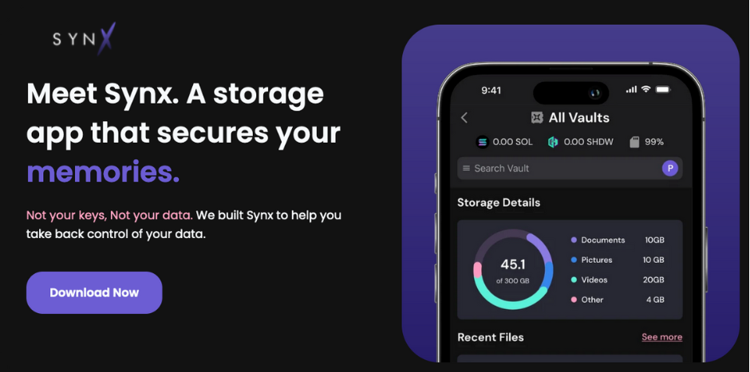
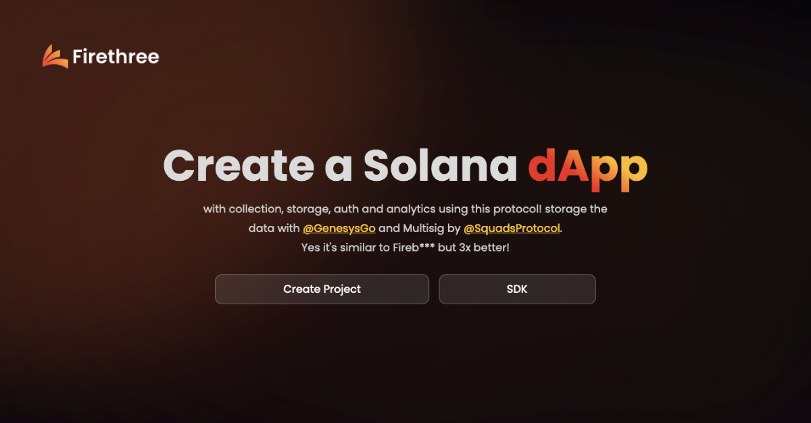
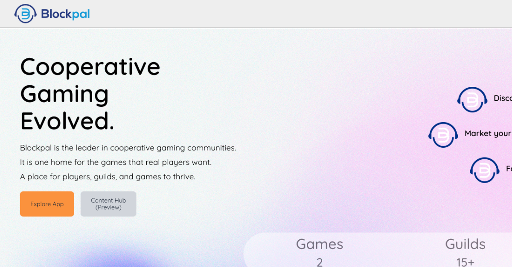
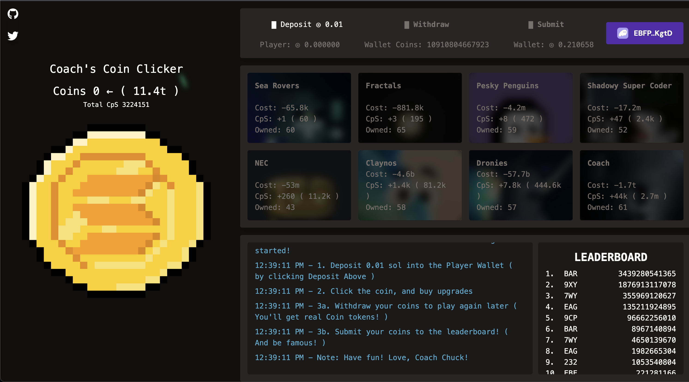

# shdwEcosystem

**Shadow Storage**

One of the most widely used GUIs for interacting with shdwDrive. A unique user experience that lets teams and individuals unlock the power of web3 through crypto and decentralization—file management, transfer & sharing, immutable storage, private notes, real-time collaboration, and more.

**SYNX**

Synx, developed by the Blxckout team, offers exceptional UI/UX for managing real-world mobile and desktop data. It also comes with comprehensive documentation, making it user-friendly. Synx is a private cloud storage solution supported by a mobile and desktop app that utilizes shdwDrive.

**SPLING**

A Social Protocol to help build on-chain social media platforms. Developer-friendly, with no prior blockchain knowledge required. Unlock new crypto experiences that your users will love—build a Web3 social app with ease.

**Firethree**

Firebase for Web3. Create your own Solana dApp with collection, storage, and analytics with this protocol. Storage by shdwDrive and multisig by SquadsProtocol.

**Blockpal**

Blockpal is the leader in cooperative gaming communities. It is one home for the games that real players want. A place for players, guilds, and games to thrive.

#### **Blok.host Web Hosting**

Simple, secure Web3 hosting with backend storage built on shdwDrive. BlokHost empowers users to quickly deploy their websites and use the platform's node network to distribute content in an optimally efficient manner globally.

[.png>)](https://blok.host/)

#### **Coach's Coin Clicker**

An example of a fully-decentralized on-chain game immortalized on shdwDrive's immutable storage. Coin Clicker showcases not only shdwDrive's impressive CDN performance, but it's ability to create perma-dApps.

#### **AlphaBatem's SHDW UI**

This tool provides a speedy way to interact with your shdwDrive storage account, including handling the swap from SOL to SHDW.



#### **A Rust CLI for ShdwDrive**

Another great contribution from a community member! A Rust-based CLI for working with ShdwDrive!



#### **Not on this list?** [**Submit a PR**](https://github.com/GenesysGo/docs-shadow-cloud) **or drop into our** [**Discord**](https://discord.gg/genesysgo) **to get added.**

\[1] Disclaimer: Please be advised that the "Shadow Ecosystem" projects displayed on our website are developed and run by independent third-party entities. GenesysGo is not responsible for any content, products, or services provided by these Third-Party Projects. The order and arrangement of the Third-Party Projects in the Ecosystem do not imply any ranking, preference, or superiority. It is solely your responsibility to evaluate the quality, security, legality, and suitability of any Third-Party Project you decide to interact with.
