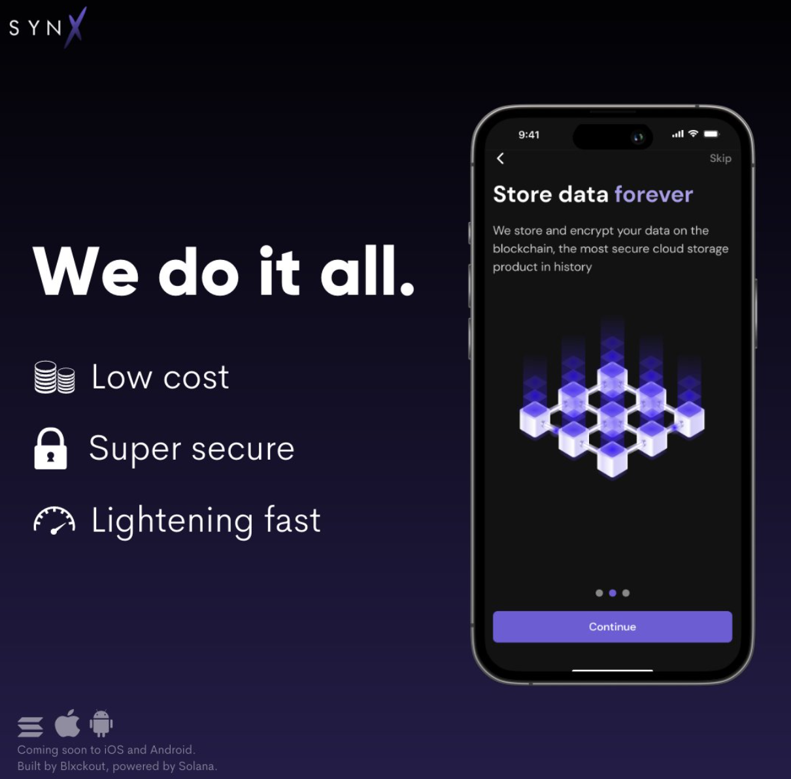
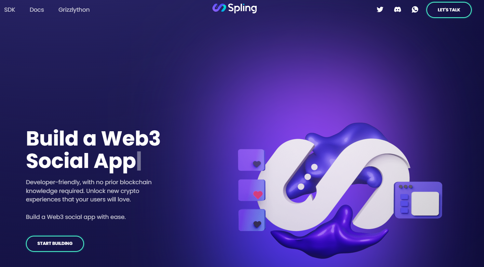
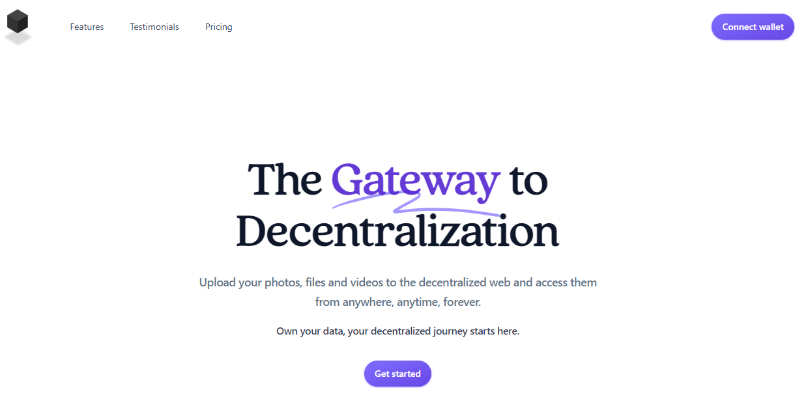
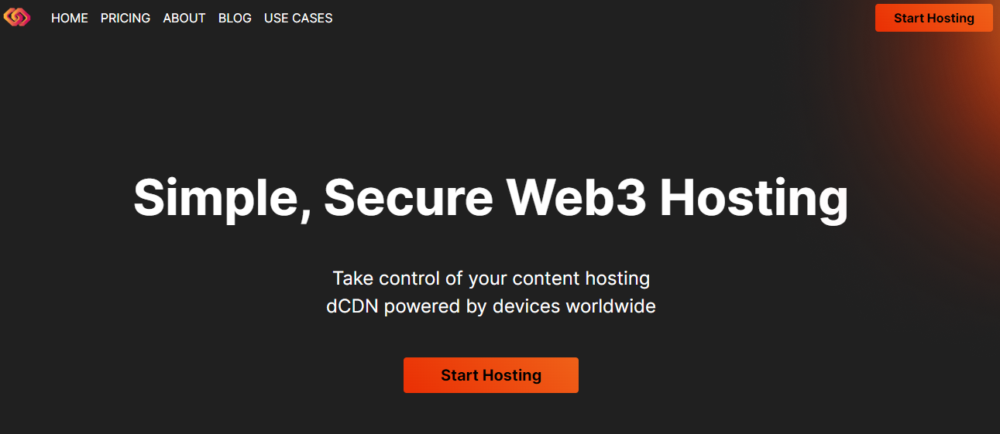

# Shadow Ecosystem

**SYNX**

Synx, developed by the Blxckout team, offers exceptional UI/UX for managing real-world mobile and desktop data. It also comes with comprehensive documentation, making it user-friendly. Synx is a private cloud storage solution supported by a mobile and desktop app that utilizes Shadow Drive.

**SPLING**

A Social Protocol to help build on-chain social media platforms. Developer-friendly, with no prior blockchain knowledge required. Unlock new crypto experiences that your users will love—build a Web3 social app with ease.

**SHADOW STORAGE**

One of the most widely used GUIs for interacting with Shadow Drive. A unique user experience that lets teams and individuals unlock the power of web3 through crypto and decentralization—file management, transfer & sharing, immutable storage, private notes, real-time collaboration, and more.

#### **Blok.host Web Hosting**

Simple, secure Web3 hosting with backend storage built on Shadow Drive. BlokHost empowers users to quickly deploy their websites and use the platform's node network to distribute content in an optimally efficient manner globally.

**SDRIVE**

Easy to use, reliable, private, and secure cloud storage built on Shadow Drive. Experience the best in secure, accessible file storage with SDrive's intuitive platform, designed with a robust toolset to support and promote content creators around the world.

[https://sdrive.app/landing](https://sdrive.app/landing)

#### **Shadow Portal**

A new primitive on Solana. A novel way to summon off-chain data aka "runes" from Shadow Drive directly into your Solana smart contract.

[https://twitter.com/ShadowyPortal](https://twitter.com/ShadowyPortal)

#### **AlphaBatem's Shadow UI**

This tool provides a speedy way to interact with your Shadow Drive storage account, including handling the swap from SOL to SHDW.



#### **ShadowTube**

A Web3 version of YouTube built with Shadow Drive storage, uploads come directly from your Shadow Drive storage accounts!



#### **Crab.so Decentralized Social Network**

Another prime example of a comprehensive suite of NFT tools should include Shadow Drive storage, and this tool delivers on all fronts.



#### **You are Loved**

A fascinating use case where an HTML doc can be served on Shadow Drive while the minting functionality and wallet connection can remain in tact. Check it out!



#### **Grape Shadow UI**

An open-sourced tool for managing Shadow Drive storage from the browser.



#### **A Rust CLI for Shadow Drive**

Another great contribution from a community member! A Rust-based CLI for working with Shadow Drive!



#### **Not on this list?** [**Submit a PR**](https://github.com/GenesysGo/docs-shadow-cloud) **or drop into our** [**Discord**](https://discord.gg/genesysgo) **to get added.**

\[1] Disclaimer: Please be advised that the "Shadow Ecosystem" projects displayed on our website are developed and run by independent third-party entities. GenesysGo is not responsible for any content, products, or services provided by these Third-Party Projects. The order and arrangement of the Third-Party Projects in the Ecosystem do not imply any ranking, preference, or superiority. It is solely your responsibility to evaluate the quality, security, legality, and suitability of any Third-Party Project you decide to interact with.
