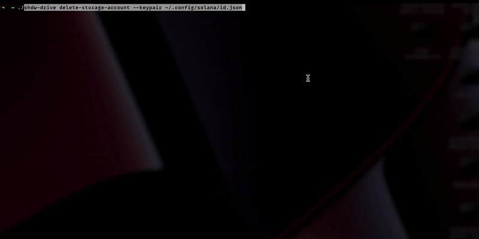

# **Contents**
* **[Install Shadow Drive CLI](#install-the-shadow-drive-cli)**
* **[Install Solana CLI](#install-the-solana-cli)**
    * **[Create a Storage Account](#create-a-storage-account)**
    * **[Upload a FIle](#upload-file-to-shadow-drive)**
* **[Rust CLI - Experimental!](#the-rust-cli)**

## **Introduction**
The CLI is probably the easiest way to interact with Shadow Drive. You can certainly use your favorite shell scripting language, or just type the commands one at a time. For test driving Shadow Drive, this is the best way to get started.

## **Install the Shadow Drive CLI**

Prerequisites: Install [NodeJS LTS 16.17.1](https://nodejs.org/en/download/) on any OS. And that's it. Then run the following command

```bash
npm install -g @shadow-drive/cli
```

Your output will look like this:

.png>)

_As an alternative, a community member created and open-sourced their own CLI that is based on Rust instead of TS:_ [_https://github.com/ebrightfield/shadow-drive-rust-cli_](https://github.com/ebrightfield/shadow-drive-rust-cli) __&#x20;

_Also enjoy this video-based guide if docs aren't quite your style_



### **Install the Solana CLI**

In order to interact with Shadow Drive, we're going to need a Solana wallet and a way to interact with the Solana blockchain. NOTE: The Shadow Drive CLI uses it's own RPC configuration. It does not use your Solana environment configuration.

Check [HERE for the latest version](https://docs.solana.com/cli/install-solana-cli-tools), as well as install methods for Windows if you are working with Windows (but seriously, no WSL? C'mon now).

```bash
sh -c "$(curl -sSfL https://release.solana.com/v1.14.3/install)"
```

Upon install, follow that up immediately with:

```bash
export PATH="/home/sol/.local/share/solana/install/active_release/bin:$PATH"
```

### **Create a Keypair file**

We need to have a keypair in .json format to use the Shadow Drive CLI. This is going to be the wallet that owns the storage account. If you want, you can convert your browser wallet into a .json file by exporting the private keys. Solflare by default exports it in a .json format (it looks like a standard array of integers, \[1,2,3,4...]. Phantom, however, needs some help and [we have just the tool to do that](https://gist.github.com/tracy-codes/f17e7ed8acfdd1be442f632f5b80763c).

If you want to create a new wallet, just use

```
solana-keygen new -o ~/shdw-keypair.json
```

<figure><figcaption></figcaption></figure>

You'll need to send a small amount of SOL and SHDW to that wallet address to proceed! The SOL is used to pay for transaction fees, the SHDW is used to create (and expand) the storage account!

### **Context-Sensitive Help**

Like most CLIs, Shadow Drive comes with help. All shadow drive commands begin with `shdw-drive`.

```
shdw-drive help
```

The above command will yield the following output

<figure><figcaption></figcaption></figure>

You can get further help on each of these commands by typing the full command, followed by the `--help` option.

```
shdw-drive create-storage-account --help
```

### **Create a Storage Account**

This is one of the few commands where you will need SHDW. Don't worry - before the command executes, it will prompt you as to how much SHDW will be required to reserve the storage account. There are three required options (which is a really weird thing to type, ya know? How can they be options if they're required?):

* \-kp, --keypair     Path to wallet that will create the storage account
* \-n, --name          What you want your storage account to be named. (Does not have to be unique)
* \-s, --size             Amount of storage you are requesting to create. Should be in a string like '1KB', '1MB', '1GB'. Only KB, MB, and GB storage delineations are supported currently.

Used in a sentence like a spelling bee?&#x20;

```
shdw-drive create-storage-account -kp ~/shdw-keypair.json -n "pony storage drive" -s 1GB
```

### **Upload File to Shadow Drive**

There are only two required options (again with the required options thing) for this command:

* \-kp, --keypair     Path to wallet that will upload the file
* \-f, --file               File path. Current file size limit is 1GB through the CLI.

Now you may be thinking to yourself "what if I have more than one storage account? How does it know which storage account to put it on?" If you weren't thinking that already, now you are. Don't worry - upon firing off the command, it will present you with a list of owned storage accounts to choose from. You can optionally provide your storage account address with:

* \-s, --storage-account     Storage account to upload file to.

Used in a sentence

```
shdw-drive upload-file -kp ~/shdw-keypair.json -f ~/CelsiusAccountHolders.csv
```

### **Upload Multiple Files to Shadow Drive**

A more realistic use case is to upload an entire directory of, say, NFT images and metadata. It's basically the same thing, except we point the command to a directory.

Requirements (I'm not saying options anymore. That's just stupid):

* \-kp, --keypair     Path to wallet that will upload the files
* \-d, --directory    Path to folder of files you want to upload.

Options (because these are optional. See? Doesn't that make more sense? Why is everything an \[option] on command line?)

* \-s, --storage-account     Storage account to upload file to.
* \-c, --concurrent              Number of concurrent batch uploads. (default: "3")

Used in a sentence

```
shdw-drive upload-multiple-files -kp ~/shdw-keypair.json -d ~/ponyNFT/assets/
```

### **Edit a File (aka Overwrite a File aka Replace a File)**

This command is used to replace an existing file _that has the exact same name._ If you attempt to upload this file using `edit-file` and an existing file with the same name is not already there, the request will fail.&#x20;

There are three requirements for this command:

* \-kp, --keypair     Path to wallet that will upload the file
* \-f, --file               File path. Current file size limit is 1GB through the CLI. File must be named the same as the one you originally uploaded
* \-u, --url               Shadow Drive URL of the file you are requesting to delete

Used in a sentence

```
shdw-drive edit-file --keypair ~/shdw-keypair.json --file ~/ponyNFT/0.json --url https://shdw-drive.genesysgo.net/abc123def456ghi789/0.json
```

### **Delete a File (aka unYeet a file)**

This should seem pretty straightforward but let's clarify something - there is no grace period or rollback for a file deletion. Once it's deleted, it's gone for good.

There are two requirements and there aren't any options outside of the standard ones:

* \-kp, --keypair    Path to the keypair file for the wallet that owns the storage account and file
* \-u, --url              Shadow Drive URL of the file you are requesting to delete

Used in a sentence

```
shdw-drive delete-file --keypair ~/shdw-keypair.json --url https://shdw-drive.genesysgo.net/abc123def456ghi789/0.json
```

### **Add Storage to Storage Account**

Men only think about one thing and it involves enlargement. Look, everyone feels insecure about the size of their Shadow Drive storage account sometimes. That's why we can pay to expand it. This is the other command that consumes SHDW tokens.

There are only two requirements for this call

* \-kp, --keypair     Path to wallet that will upload the files
* \-s, --size             Amount of storage you are requesting to add to your storage account. Should be in a string like '1KB', '1MB', '1GB'. Only KB, MB, and GB storage delineations are supported currently

If you have more than one account, you'll get to pick which storage account you want to add storage to.

Used in a sentence

```
shdw-drive add-storage -kp ~/shdw-keypair.json -s 100MB
```

### **Reduce Storage Account Size**

Sounds like blasphemy but hear me out - what if you reserved a 1GB storage account, and then only used 500MB of it? Turns out your size is not size. You can reduce your storage account and reclaim your unused SHDW tokens this way. _**This is a two part operation**_ where you first reduce your account size, and then request your SHDW tokens. First, let's reduce the storage account size.&#x20;

There are two requirements

* \-kp, --keypair     Path to wallet that will upload the files
* \-s, --size            Amount of storage you are requesting to remove from your storage account. Should be in a string like '1KB', '1MB', '1GB'. Only KB, MB, and GB storage delineations are supported currently

Used in a sentence

```
shdw-drive reduce-storage -kp ~/shdw-keypair.json -s 500MB
```

### **Claim Stake (aka Claim Unused SHDW Tokens after Reduction)**

So glad I got to use that gif.&#x20;

Since you reduced the amount of storage being used in the previous step, you are now free to claim your unused SHDW tokens. The only requirement here is a keypair.

Used in a sentence

```
shdw-drive claim-stake -kp ~/shdw-keypair.json
```

### **Delete a Storage Account**

Can we talk about how Paul Rudd doesn't age for a second?&#x20;

\When you're ready to go scorched earth, you can tear down your storage account entirely. Upon total completion, your SHDW tokens will be returned to the wallet.&#x20;

NOTE: You have a grace period upon deletion that lasts until the end of the current Solana epoch. [Go HERE to see](https://explorer.solana.com/) how much time is remaining in the current Solana epoch to know how much grace period you will get.&#x20;

All you need here is a keypair, and it will prompt you for the specific storage account to delete.

Used in a sentence

```
shdw-drive delete-storage-account ~/shdw-keypair.json
```

### **Undelete a Storage Account**

They always come back. Unless the epoch has elapsed. Then they don't. But if the epoch is still active, you can undelete your storage account. Same drill as before, only need a keypair. You will be prompted to select a storage account when running the command. This removes the deletion request and it's business as usual.

```
shdw-drive undelete-storage-account -kp ~/shdw-keypair.json
```

### **Make Storage Account Immutable**

One of the coolest things about Shadow Drive is that you can make your storage truly permanent. With immutable storage, no file that was uploaded to the account can ever be deleted or edited. They are solidified and permanent, as is the storage account itself. You CAN still continue to upload files to an immutable account, as well as add storage to an immutable account.&#x20;

As before, the only requirement is a keypair. You will be prompted to select a storage account when running the command.

Used in a sentence&#x20;

```
shdw-drive make-storage-account-immutable -kp ~/shdw-keypair.json
```


# **The Rust CLI**

## Getting Started

### Installation

`npm install -g @shadow-drive/cli` or `yarn global add @shadow-drive/cli`

The basic flow of Shadow Drive is as follows:

1. Get some [$SHDW](https://www.orca.so) in your wallet (you will need a [command line wallet](https://docs.solana.com/es/wallet-guide/cli))
2. Create your storage account with the [create storage account](https://github.com/GenesysGo/shadow-drive-cli#create-storage-account) command
3. Upload your file(s) with the [upload file](https://github.com/GenesysGo/shadow-drive-cli#upload-file) or [upload multiple files](https://github.com/GenesysGo/shadow-drive-cli#upload-multiple-files) commands
4. Optional: Mark your storage account as immutable to permanently lock your files in place with the [make storage account immutable command](https://github.com/GenesysGo/shadow-drive-cli#make-storage-account-immutable)
5. Congratulations, you're now storing your files on Shadow Drive!

## Command Reference

### Help

Example: `shdw-drive help`

### Create Storage Account

Example: `shdw-drive create-storage-account --keypair ~/.config/solana/id.json --name "My Storage Account" --size 10MB`

This command will create your storage account for you. You will be shown the estimated $SHDW amount required to create the storage account before continuing with submitting the transaction to Solana and the Shadow Drive Network.

Parameters:

1. Keypair: Path to wallet that will create the storage account
2. Name: What you want your storage account to be named. (Does not have to be unique)
3. Size: Amount of storage you are requesting to create. Should be in a string like '1KB', '1MB', '1GB'. Only KB, MB, and GB storage delineations are supported currently.

### Make Storage Account Immutable

Example: `shdw-drive make-storage-account-immutable --keypair ~/.config/solana/id.json`

This will permanently lock your storage account and all files within it. You will not be able to add/reduce storage on this account, delete the storage account, or edit/delete files under this storage account.

When running this command, you will be presented with a list of storage accounts that the wallet passed in, is an admin of, and has authority to make the account immutable.

The stake from the storage account that you mark as immutable will also be deducted and closed.

Parameters:

1. Keypair: Path to the wallet that is an admin of the storage account you want to make immutable.

### Delete Storage Account

Example: `shdw-drive delete-storage-account --keypair ~/.config/solana/id.json`

If the storage account you select is not marked as immutable, you can request to delete the account. Once this request has been fully processed by a crank, your storage account and all files within it will be removed from the Shadow Drive Network. Any remaining stake in your storage account will be returned to you.

You will be presented with a list of storage accounts to choose from that you'd like to undo a deletion request for.

NOTE: Once you submit this request, you will have a grace period of the rest of the current Solana Epoch to undo this request. Once Solana's clock reaches the next epoch, you will not be able to undo this request and your account will be available for a crank to fully process the deletion.

Parameters:

1. Keypair: Path to wallet that is an admin of the storage account you want to request for deletion



### Undo Storage Account Deletion Request

Example: `shdw-drive undelete-storage-account --keypair ~/.config/solana/id.json`

This will undo a storage account deletion request. When running this command, you will be presented with a list of accounts to choose from that have been requested to be deleted and are still within the grace period.

NOTE: There is a grace period between when you request for your storage account to be deleted and when it's actually deleted. Currently it is set to be within the Solana Epoch that you requested to delete your storage account. For example, if you requested to delete a storage account in Solana Epoch 306, once Solana's clock reaches epoch 307, you are no longer able to undo the deletion request and it will be available for a crank to fully process the deletion.

Parameters:

1. Keypair: Path to the wallet that is an admin of the storage account you want to undo a deletion request for

### Add Storage

Example: `shdw-drive add-storage --keypair ~/.config/solana/id.json --size 10MB`

This will add storage capacity to an existing storage account that you select when running this command. When running this command, you will be presented with a list of accounts to choose from.

Parameters:

1. Keypair: Path to the wallet that is an admin of the storage account you want to add storage capacity to.

### Reduce Storage

Example: `shdw-drive reduce-storage --keypair ~/.config/solana/id.json --size 10MB`

This will reduce the total storage capacity available for given storage account. When running this command, you will be presented with a list of accounts to choose from.

After reducing storage on a storage account, you can run `claim-stake` to recover the $SHDW back to your wallet.

Parameters:

1. Keypair: Path to the wallet that is an admin of the storage account you want to reduce storage on.

### Claim Stake

Example: `shdw-drive claim-stake --keypair ~/.config/solana/id.json`

This will claim any available stake as a result of the `reduce storage` command. You will be presented with a list of storage accounts and the amount of stake claimable to choose from.

Parameters:

1. Keypair: Path to the wallet that is an admin of the storage account you want to claim stake from.

### Upload File

Example: `shdw-drive upload-file --keypair ~/.config/solana/id.json --file ~/Documents/something-important.md`

This will upload a file at the supplied path. When uploading a file, you will be presented with a list of storage accounts to choose from and use as the account that stores your file.

Parameters:

1. Keypair: Path to the wallet that is an admin of the storage account you want to upload to
2. File: Path to the file you want to upload. This can be a relative or absolute path.

> **Note**: If you get the error `Server response status message: failed to send transaction: Transaction simulation failed: Transaction leaves an account with a lower balance than rent-exempt minimum` it means you do not have the minimum amount of SOL required in your wallet for your account to be [rent-exempted](https://docs.solana.com/developing/programming-model/accounts#rent-exemption) after the operation.<br /><br />Send some SOL to your wallet and try again.

### Upload Multiple Files

Example: `shdw-drive upload-multiple-files --keypair ~/.config/solana/id.json --directory ~/Documents/my-expensive-jpgs/`

This will allow you to upload all files in a given directory. If the file already exists, the upload for that file will be skipped and you will get back the finalized Shadow Drive URL in the response. When running this command, you will be presented with a list of storage accounts to choose from, and only the ones with enough storage for the entire directory supplied will be selectable.

The log of this command will be written to a `.json` file in your current directory.

Parameters:

1. Keypair: Path to the wallet that is an admin of the storage account you want to upload
2. Directory: Path to the folder of files you want to upload.

It is possible some files will not upload - and this will be reflected in the `.json` file mentioned above. The results are also printed to the terminal when the upload-multiple-files command completes. You can identify which files have failed to upload by searching for 'location: null' in the file.

To re-upload the files that failed to upload when you initially ran the command - simply rerun the same command. The command checks if a file has already been uploaded and then moves on to the files which haven't yet been uploaded.

The following command was used for this, with the folder containing files [0-10].gif & [0-10].json:
shdw-drive upload-multiple-files --env mainnet-beta --keypair /home/ssc/.config/solana/test.json -d test_diamond/

### Edit File

Example: `shdw-drive edit-file --keypair ~/.config/solana/id.json --file ~/Documents/something-important --url https://shdw-drive.genesysgo.net/abc123def456ghi789/something-important.md`

This will replace a file that exists on Shadow Drive with the new file supplied.

NOTE: The file you are wanting to edit must be the same name of the file that already exists in your storage account. If it does not already exist on Shadow Drive, your request will fail. If the file you want to submit to Shadow Drive has a different name, you must perform a new upload request instead.

Parameters:

1. Keypair: Path to the wallet that is an admin of the storage account the file was originally uploaded to
2. File: New file you want to upload
3. URL: The Shadow Drive URL of the file that currently exists

### Delete File

Example: `shdw-drive delete-file --keypair ~/.config/solana/id.json --url https://shdw-drive.genesysgo.net/abc123def456ghi789/something-important.md`

This will submit a request to delete the file supplied.

NOTE: Once you submit this request, you will have a grace period of the rest of the current Solana Epoch to undo this request. Once Solana's clock reaches the next epoch, you will not be able to undo this request and your file will be available for a crank to fully process the deletion.

Parameters:

1. Keypair: Path to the wallet that is an admin of the storage account the file was originally uploaded to
2. URL: The Shadow Drive URL of the file you're requesting to delete

### Undelete File

Example: `shdw-drive undelete-file --keypair ~/.config/solana/id.json --url https://shdw-drive.genesysgo.net/abc123def456ghi789/something-important.md`

This will undo a deletion request for the file supplied if it's still within the grace period.

NOTE: There is a grace period between when you request for your storage account to be deleted and when it's actually deleted. Currently it is set to be within the Solana Epoch that you requested to delete your storage account. For example, if you requested to delete a storage account in Solana Epoch 306, once Solana's clock reaches epoch 307, you are no longer able to undo the deletion request and your file will be available for a crank to fully process the deletion.

Parameters:

1. Keypair: Path to the wallet that is an admin of the storage account the file was originally uploaded to
2. URL: The Shadow Drive URL of the file you're requesting to delete

