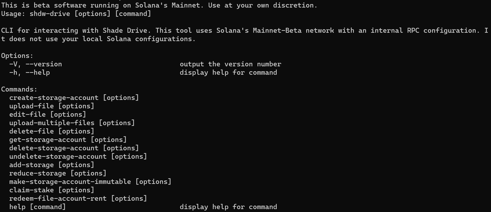

# CLI

## **Contents**

* [**Install ShdwDrive CLI**](the-cli.md#install-the-shadow-drive-cli)
  * [**Video Walkthrough**](the-cli.md#video-guide-and-walkthrough)
  * [**Install Solana CLI**](the-cli.md#install-the-solana-cli)
  * [**Create a Storage Account**](the-cli.md#create-a-storage-account)
  * [**Upload a FIle**](the-cli.md#upload-file-to-shadow-drive)
  * [**Upload Multiple FIles**](the-cli.md#upload-multiple-files-to-shadow-drive)
  * [**Edit a File**](the-cli.md#edit-a-file-aka-overwrite-a-file-aka-replace-a-file)
  * [**Delete a File**](the-cli.md#delete-a-file)
  * [**Add Storage**](the-cli.md#add-storage-to-storage-account)
  * [**Reduce Storage**](the-cli.md#reduce-storage-account-size)
  * [**Make File Immutable**](the-cli.md#make-storage-account-immutable)
* [**Install Rust CLI - Experimental!**](the-cli.md#the-rust-cli)

## **Introduction**

The CLI is the easiest way to interact with ShdwDrive. You can use your favorite shell scripting language, or just type the commands one at a time. For test driving ShdwDrive, this is the best way to get started.

## **Install the ShdwDrive CLI**

Prerequisites: Install [NodeJS LTS 16.17.1](https://nodejs.org/en/download/) on any OS.

Then run the following command

```bash
npm install -g @shadow-drive/cli
```

#### [**Video Guide and Walkthrough**](https://www.youtube.com/watch?v=MfSuzFDDQ30)

### **Install the Solana CLI**

In order to interact with ShdwDrive, we're going to need a Solana wallet and CLI to interact with the Solana blockchain.

_NOTE: The ShdwDrive CLI uses it's own RPC configuration. It does not use your Solana environment configuration._

Check [HERE for the latest version](https://docs.solana.com/cli/install-solana-cli-tools).

```bash
sh -c "$(curl -sSfL https://release.solana.com/v1.14.3/install)"
```

Upon install, follow that up immediately with:

```bash
export PATH="/home/sol/.local/share/solana/install/active_release/bin:$PATH"
```

### **Create a Keypair file**

We need to have a keypair in .json format to use the ShdwDrive CLI. This is going to be the wallet that owns the storage account. If you want, you can convert your browser wallet into a .json file by exporting the private keys. Solflare by default exports it in a .json format (it looks like a standard array of integers, \[1,2,3,4...]. Phantom, however, needs some help and [we have just the tool to do that](https://gist.github.com/tracy-codes/f17e7ed8acfdd1be442f632f5b80763c).

If you want to create a new wallet, just use

```
solana-keygen new -o ~/shdw-keypair.json
```

You will see it write a new keypair file and it was display the `pubkey` which is your wallet address.

**You'll need to send a small amount of SOL and SHDW to that wallet address to proceed! The SOL is used to pay for transaction fees, the SHDW is used to create (and expand) the storage account!**

#### **Context-Sensitive Help**

ShdwDrive CLI comes with integrated help. All ShdwDrive commands begin with `shdw-drive`.

```
shdw-drive help
```

The above command will yield the following output

<figure><figcaption></figcaption></figure>

You can get further help on each of these commands by typing the full command, followed by the `--help` option.

```
shdw-drive create-storage-account --help
```

### **Create a Storage Account**

This is one of the few commands where you will need [SHDW](https://docs.shadow.cloud/reference/shdw-token). Before the command executes, it will prompt you as to how much [SHDW](https://docs.shadow.cloud/reference/shdw-token) will be required to reserve the storage account. There are three required options:

`-kp, --keypair`

* Path to wallet that will create the storage account

`-n, --name`

* What you want your storage account to be named. (Does not have to be unique)

`-s, --size`

* Amount of storage you are requesting to create. This should be in a string like '1KB', '1MB', '1GB'. Only KB, MB, and GB storage delineations are supported.

**Example:**

```
shdw-drive create-storage-account -kp ~/shdw-keypair.json -n "pony storage drive" -s 1GB
```

### **Upload File to ShdwDrive**

There are only two required options for this command:

`-kp, --keypair`

* Path to wallet that will upload the file

`-f, --file`

* File path. Current file size limit is 1GB through the CLI.

If you have multiple storage accounts it will present you with a list of owned storage accounts to choose from. You can optionally provide your storage account address with:

`-s, --storage-account`

* Storage account to upload file to.

**Example:**

```
shdw-drive upload-file -kp ~/shdw-keypair.json -f ~/AccountHolders.csv
```

### **Upload Multiple Files to ShdwDrive**

A more realistic use case is to upload an entire directory of, say, NFT images and metadata. It's basically the same thing, except we point the command to a directory.

Options:

`-kp, --keypair`

* Path to wallet that will upload the files

`-d, --directory`

* Path to folder of files you want to upload.

`-s, --storage-account`

* Storage account to upload file to.

`-c, --concurrent`

* Number of concurrent batch uploads. (default: "3")

**Example:**

```
shdw-drive upload-multiple-files -kp ~/shdw-keypair.json -d ~/ponyNFT/assets/
```

### **Edit a File (aka Overwrite a File aka Replace a File)**

This command is used to replace an existing file _that has the exact same name._ If you attempt to upload this file using `edit-file` and an existing file with the same name is not already there, the request will fail.

There are three requirements for this command:

`-kp, --keypair`

* Path to wallet that will upload the file

`-f, --file`

* File path. Current file size limit is 1GB through the CLI. File must be named the same as the one you originally uploaded

`-u, --url`

* ShdwDrive URL of the file you are requesting to delete

**Example:**

```
shdw-drive edit-file --keypair ~/shdw-keypair.json --file ~/ponyNFT/01.json --url https://shdw-drive.genesysgo.net/abc123def456ghi789/0.json
```

### **Delete a File**

This is straightforward and it's important to note once it's deleted, it's gone for good.

There are two requirements and there aren't any options outside of the standard ones:

`-kp, --keypair`

* Path to the keypair file for the wallet that owns the storage account and file

`-u, --url`\
ShdwDrive URL of the file you are requesting to delete

**Example:**

```
shdw-drive delete-file --keypair ~/shdw-keypair.json --url https://shdw-drive.genesysgo.net/abc123def456ghi789/0.json
```

### **Add Storage to Storage Account**

You can expand the storage size of a storage account. This command consumes SHDW tokens.

There are only two requirements for this call

`-kp, --keypair`

* Path to wallet that will upload the files

`-s, --size`

* Amount of storage you are requesting to add to your storage account. Should be in a string like '1KB', '1MB', '1GB'. Only KB, MB, and GB storage delineations are supported currently

If you have more than one account, you'll get to pick which storage account you want to add storage to.

**Example:**

```
shdw-drive add-storage -kp ~/shdw-keypair.json -s 100MB
```

### **Reduce Storage Account Size**

You can reduce your storage account and reclaim your unused SHDW tokens. _**This is a two part operation**_ where you first reduce your account size, and then request your SHDW tokens. First, let's reduce the storage account size.

There are two requirements

`-kp, --keypair`

* Path to wallet that will upload the files

`-s, --size`

* Amount of storage you are requesting to remove from your storage account. Should be in a string like '1KB', '1MB', '1GB'. Only KB, MB, and GB storage delineations are supported currently

**Example:**

```
shdw-drive reduce-storage -kp ~/shdw-keypair.json -s 500MB
```

### **Claim Stake (aka Claim Unused** [**SHDW**](https://docs.shadow.cloud/reference/shdw-token) **Tokens after Reduction)**

Since you reduced the amount of storage being used in the previous step, you are now free to claim your unused [SHDW](https://docs.shadow.cloud/reference/shdw-token) tokens. The only requirement here is a keypair.

**Example:**\*\*

```
shdw-drive claim-stake -kp ~/shdw-keypair.json
```

### **Delete a Storage Account**

You can entirely remove a storage account from ShdwDrive. Upon completion, your [SHDW](https://docs.shadow.cloud/reference/shdw-token) tokens will be returned to the wallet.

_NOTE: You have a grace period upon deletion that lasts until the end of the current Solana epoch._ [_Go HERE to see_](https://explorer.solana.com/) _how much time is remaining in the current Solana epoch to know how much grace period you will get._

All you need here is a keypair, and it will prompt you for the specific storage account to delete.

**Example:**

```
shdw-drive delete-storage-account ~/shdw-keypair.json
```

### **Undelete a Storage Account**

Assuming the epoch is still active, you can undelete your storage account. You only need a keypair. You will be prompted to select a storage account when running the command. This removes the deletion request.

```
shdw-drive undelete-storage-account -kp ~/shdw-keypair.json
```

### **Make Storage Account Immutable**

One of the most unique and useful features of ShdwDrive is that you can make your storage truly permanent. With immutable storage, no file that was uploaded to the account can ever be deleted or edited. They are solidified and permanent, as is the storage account itself. You can still continue to upload files to an immutable account, as well as add storage to an immutable account.

The only requirement is a keypair. You will be prompted to select a storage account when running the command.

**Example:**

```
shdw-drive make-storage-account-immutable -kp ~/shdw-keypair.json
```

## **The Rust CLI**

### **(This section is under development)**

### **CreateStorageAccount**

Create an account on which to store data. Storage accounts can be globally, irreversibly marked immutable for a one-time fee. Otherwise, files can be added or deleted from them, and space rented indefinitely.

**Parameters:**

`--name`

* String

`--size`

* Byte

**Example:**

```
shadow-drive-cli create-storage-account --name example_account --size 10MB
```

### **DeleteStorageAccount**

Queues a storage account for deletion. While the request is still enqueued and not yet carried out, a cancellation can be made (see cancel-delete-storage-account subcommand).

**Parameters:**

`--storage-account`

* Pubkey

**Example:**

```
shadow-drive-cli delete-storage-account --storage-account FKDU64ffTrQq3E1sZsNknefrvY8WkKzCpRyRfptTnyvB
```

**Example:**

```
shadow-drive-cli delete-storage-account FKDU64ffTrQq3E1sZsNknefrvY8WkKzCpRyRfptTnyvB
```

### **CancelDeleteStorageAccount**

Cancels the deletion of a storage account enqueued for deletion.

**Parameters:**

`--storage-account`

* Pubkey

**Example:**

```
shadow-drive-cli cancel-delete-storage-account --storage-account FKDU64ffTrQq3E1sZsNknefrvY8WkKzCpRyRfptTnyvB
```

**Example:**

```
shadow-drive-cli cancel-delete-storage-account FKDU64ffTrQq3E1sZsNknefrvY8WkKzCpRyRfptTnyvB
```

### **ClaimStake**

Redeem tokens afforded to a storage account after reducing storage capacity.

**Parameters:**

`--storage-account`

* Pubkey

**Example:**

```
shadow-drive-cli claim-stake --storage-account FKDU64ffTrQq3E1sZsNknefrvY8WkKzCpRyRfptTnyvB
```

**Example:**

```
shadow-drive-cli claim-stake FKDU64ffTrQq3E1sZsNknefrvY8WkKzCpRyRfptTnyvB
```

### **AddStorage**

Increase the capacity of a storage account.

**Parameters:**

`--storage-account`

* Pubkey

`--size`

* Byte (accepts KB, MB, GB)

**Example:**

```
shadow-drive-cli add-storage --storage-account FKDU64ffTrQq3E1sZsNknefrvY8WkKzCpRyRfptTnyvB --size 10MB
```

**Example:**

```
shadow-drive-cli add-storage FKDU64ffTrQq3E1sZsNknefrvY8WkKzCpRyRfptTnyvB 10MB
```

### **AddImmutableStorage**

Increase the immutable storage capacity of a storage account.

**Parameters:**

`--storage-account`

* Pubkey

`--size`

* Byte (accepts KB, MB, GB)

**Example:**

```
shadow-drive-cli add-immutable-storage --storage-account FKDU64ffTrQq3E1sZsNknefrvY8WkKzCpRyRfptTnyvB --size 10MB
```

**Example:**

```
shadow-drive-cli add-immutable-storage FKDU64ffTrQq3E1sZsNknefrvY8WkKzCpRyRfptTnyvB 10MB
```

### **ReduceStorage**

Reduce the capacity of a storage account.

**Parameters:**

`--storage-account`

* Pubkey

`--size`

* Byte (accepts KB, MB, GB)

**Example:**

```
shadow-drive-cli reduce-storage --storage-account FKDU64ffTrQq3E1sZsNknefrvY8WkKzCpRyRfptTnyvB --size 10MB
```

**Example:**

```
shadow-drive-cli reduce-storage FKDU64ffTrQq3E1sZsNknefrvY8WkKzCpRyRfptTnyvB 10MB
```

### **MakeStorageImmutable**

Make a storage account immutable. This is irreversible.

**Parameters:**

`--storage-account`

* Pubkey

**Example:**

```
shadow-drive-cli make-storage-immutable --storage-account FKDU64ffTrQq3E1sZsNknefrvY8WkKzCpRyRfptTnyvB
```

**Example:**

```
shadow-drive-cli make-storage-immutable FKDU64ffTrQq3E1sZsNknefrvY8WkKzCpRyRfptTnyvB
```

### **GetStorageAccount**

Fetch the metadata pertaining to a storage account.

**Parameters:**

`--storage-account`

* Pubkey

**Example:**

```
shadow-drive-cli get-storage-account --storage-account FKDU64ffTrQq3E1sZsNknefrvY8WkKzCpRyRfptTnyvB
```

**Example:**

```
shadow-drive-cli get-storage-account FKDU64ffTrQq3E1sZsNknefrvY8WkKzCpRyRfptTnyvB
```

### **GetStorageAccounts**

Fetch a list of storage accounts owned by a particular pubkey. If no owner is provided, the configured signer is used.

**Parameters:**

`--owner`

* Option\<Pubkey>

**Example:**

```
shadow-drive-cli get-storage-accounts --owner FKDU64ffTrQq3E1sZsNknefrvY8WkKzCpRyRfptTnyvB
```

**Example:**

```
shadow-drive-cli get-storage-accounts
```

### **ListFiles**

List all the files in a storage account.

**Parameters:**

`--storage-account`

* Pubkey

**Example:**

```
shadow-drive-cli list-files --storage-account FKDU64ffTrQq3E1sZsNknefrvY8WkKzCpRyRfptTnyvB
```

**Example:**

```
shadow-drive-cli list-files FKDU64ffTrQq3E1sZsNknefrvY8WkKzCpRyRfptTnyvB
```

### **GetText**

Get a file, assume it's text, and print it.

**Parameters:**

`--storage-account`

* Pubkey

`--filename`

**Example:**

```
shadow-drive-cli get-text --storage-account FKDU64ffTrQq3E1sZsNknefrvY8WkKzCpRyRfptTnyvB --filename example.txt
```

**Example:**

```
shadow-drive-cli get-text FKDU64ffTrQq3E1sZsNknefrvY8WkKzCpRyRfptTnyvB example.txt
```

### **GetObjectData**

Get basic file object data from a storage account file.

**Parameters:**

`--storage-account`

* Pubkey

`--file`

* String

**Example:**

```
shadow-drive-cli get-object-data --storage-account FKDU64ffTrQq3E1sZsNknefrvY8WkKzCpRyRfptTnyvB --file example.txt
```

**Example:**

```
shadow-drive-cli get-object-data FKDU64ffTrQq3E1sZsNknefrvY8WkKzCpRyRfptTnyvB example.txt
```

### **DeleteFile**

Delete a file from a storage account.

**Parameters:**

`--storage-account`

* Pubkey

`--filename`

* String

**Example:**

```
shadow-drive-cli delete-file --storage-account FKDU64ffTrQq3E1sZsNknefrvY8WkKzCpRyRfptTnyvB --filename example.txt
```

**Example:**

```
shadow-drive-cli delete-file FKDU64ffTrQq3E1sZsNknefrvY8WkKzCpRyRfptTnyvB example.txt
```

### **EditFile**

Edit a file in a storage account.

**Parameters:**

`--storage-account`

* Pubkey

`--path`

* PathBuf

**Example:**

```
shadow-drive-cli edit-file --storage-account FKDU64ffTrQq3E1sZsNknefrvY8WkKzCpRyRfptTnyvB --path /path/to/new/file.txt
```

**Example:**

```
shadow-drive-cli edit-file FKDU64ffTrQq3E1sZsNknefrvY8WkKzCpRyRfptTnyvB /path/to/new/file.txt
```

### **StoreFiles**

Upload one or more files to a storage account.

**Parameters:**

`--batch-size`

* usize (default: value of FILE\_UPLOAD\_BATCH\_SIZE)

`--storage-account`

* Pubkey

`--files`

* Vec\<PathBuf>

**Example:**

```
shadow-drive-cli store-files --batch-size 100 --storage-account FKDU64ffTrQq3E1sZsNknefrvY8WkKzCpRyRfptTnyvB file1.txt file2.txt
```

**Example:**

```
shadow-drive-cli store-files FKDU64ffTrQq3E1sZsNknefrvY8WkKzCpRyRfptTnyvB file1.txt file2.txt
```
