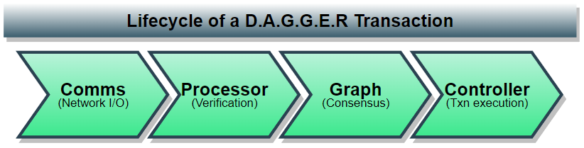
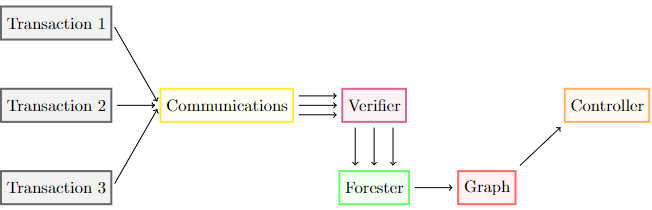
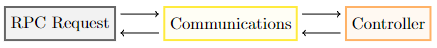

# D.A.G.G.E.R

## **Introduction**
DAGGER is a distributed system with a graph based consensus mechanism. There are four components that make up the protocol specification. This article will explain on a high level each of these four components and how they would interact with an incoming request. For simplicity, the use-case of the transaction can be considered a request to store a file on Shadow Drive. There are many possible and planned implementations of the GenesysgGo's D.A.G.G.E.R., however the flagship implementation will be Shadow Drive v2 - a soon to be released enhancement on the current Shadow Drive v1.5. This is why we regard a "transactions" as simply a write request submitted by a user. This section wraps by explaining how speed, stability, and scalability are why we chose to build a brand new cutting edge acyclic-graph-style consensus technology.

### **Overview**
The components, in the order an incoming transaction would see them throughout its lifecycle are illustrated the figure below:

<figure><figcaption></figcaption></figure>

### **Terminology**

The following list defines a few terms commonly used throughout this document:

* Transaction: A write request submitted by a user. A transaction can contain raw bytes,
membership management requests, and Shadow transactions ([Shadow Drive/Cloud actions
e.g. store file, instantiate VM).

* Block: A set of transactions that are packed into a [Merkle Tree]() whose root hash is included
in a node in the [DAG]().

* Event: A node in the DAG, which contains the hashes of its parents, a timestamp, a
Block payload, and the creator’s signature of the aforementioned.

The DAGGER system reaches consensus on the ordering of Events via asynchronous computations on a local graph.

## **Components**

### **Communications (Network I/O)**

The communications module initializes outgoing sync requests with peers and forwards sync
responses from peers to the processor, handles incoming sync requests from peers, forwards
transactions to the processor, forwards RPC requests to the controller, and maintains a peer IP
database.

* **Outgoing Sync Requests**
    * To initialize a sync request, we begin by selecting a random active peer which has not recently
been synced with. Since we need the most up-to-date peer list along with a summary of our
current graph’s state, the communications module sends a request to the graph module to
summarize the current graph’s state and choose a peer 1. The communications receives the state
summary and a chosen peer, sends it to the peer and awaits a sync response, which is forwarded
to the graph module to be digested.

* **Incoming Sync Requests**
    * An incoming sync request is immediately forward to the graph module. We await a packaged
sync response containing all events that we have which the peer does not have, which is sent
back to the peer.

* **Incoming Transactions**
    * When a user submits a transaction, the communications module receives forwards it to the
processor. After verification, the transaction makes it way through the forester and the graph
module which, upon inclusion in a block, sends back the signature for the event which contains
the block in which the transaction was included. The communications module forwards this
signature back to the user. Note that this does not mean the block has been finalized.
    <figure><figcaption></figcaption></figure>

* **Incoming RPC Requests**
    * When a user submits one of several possible RPC requests, whether it be to read a file or inquire
about a block or transaction, it is forwarded to the controller. The controller sends back the
result of the ledger query to the communications module, which forwards it to the user.
    <figure><figcaption></figcaption></figure>

### **Processor (Verification)**

The verifier and forester are sibling modules responsible for verification of events, blocks, and
transactions. The verification happens for events made by peers, as well as for incoming trans-
actions made by users. There are several forms of verification: signature verification for trans-
actions, signature verification for blocks, and root hash verification for blocks. When processing
peer events, the verifier is responsible for the first two of these forms of verification, while the
forester is responsible for verification of the root hash of the transaction Merkle trees that form
the blocks. When processing incoming user transactions, the forester gathers transactions to
pack into a block and produces the Merkle root hash which represents the block.

### **Graph (Consensus)**

At a high level, the graph has two core responsibilities along with some collaborative duties.
The two core responsibilities are: to digest sync responses to build up the gossip graph, and to
analyze the graph to derive the consensus ordering of events. The collaborative duties are to help
the communications module decide which peer to sync with and to inform the communications
module

### **Controller (Transaction Execution)**

The controller module performs reads and writes to the ledger. This is where different use cases
of DAGGER will vary the most. For filesystem applications of DAGGER (e.g. Shadow Drive),
this includes operations like shredding and erasure coding. For other use cases like oracles,
bridges, and VM orchestration, this is where external calls are made.

## **Why is D.A.G.G.E.R using acyclic-graphs for consensus?**

Proof-of-stake (PoS) and proof-of-work (PoW) are two of the most popular consensus mechanisms used in blockchain networks. In PoS, validators or nodes are chosen to validate transactions based on the amount of cryptocurrency they hold and are willing to "stake." The more they hold and stake, the higher the probability of being selected as the validator. In PoW, miners compete to solve complex mathematical problems, and the first one to solve it is rewarded with cryptocurrency and the right to validate transactions.

On the other hand, D.A.G.G.E.R. is a directed acyclic graph-based consensus mechanism, where nodes directly communicate with each other and share their transactions, creating a DAG of transactions. In this DAG, every node has its own history of transactions, and consensus is reached by analyzing the entire graph and identifying a single, agreed-upon order of transactions. This process allows for high throughput and fast finality, making it an attractive choice for applications that require high speed and scalability.

In the case of a decentralized storage network like GenesysGo Shadow Drive, D.A.G.G.E.R. allows for horizontal scalability, meaning that the network can grow by adding more nodes, increasing storage capacity, and processing power without compromising the speed or security of the network. This is because each node can process and validate transactions independently, and the final consensus is reached by analyzing the entire DAG.

Proof-of-storage (PoS) consensus mechanisms like Filecoin and IPFS, on the other hand, allow for decentralized storage by incentivizing participants to store and retrieve data in exchange for cryptocurrency rewards. PoS systems have the potential to offer greater security than centralized storage solutions, as data is distributed across multiple nodes, making it difficult for any single node to compromise the network. However, PoS systems typically require a significant amount of storage capacity and computational resources to participate, making it less accessible to the general public.

In summary, D.A.G.G.E.R. protocol offers a unique consensus mechanism that allows for high throughput, fast finality, and horizontal scalability, making it an attractive choice for decentralized applications like Shadow Drive. PoS, PoW, and PoS consensus mechanisms all offer different benefits and trade-offs, and the choice of which one to use depends on the specific requirements of the application.