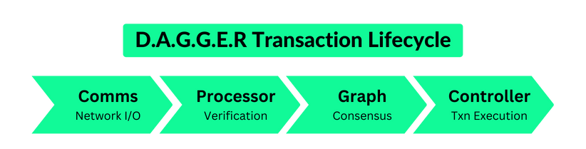
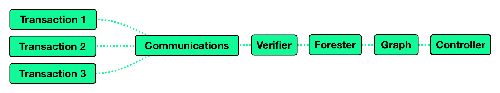
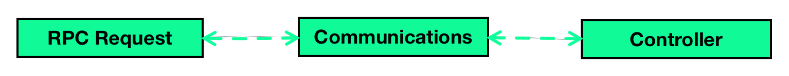
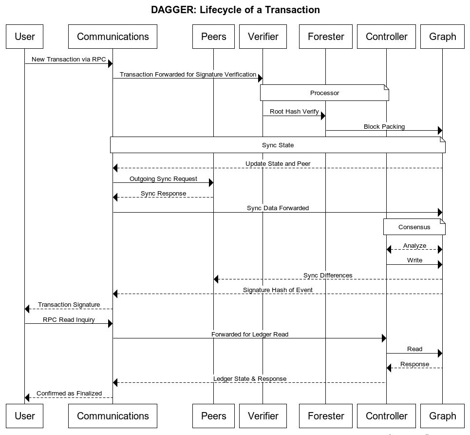

# D.A.G.G.E.R

## **Introduction**

DAGGER is a distributed system with a graph based consensus mechanism. There are four components that make up the protocol specification. This article will explain on a high level each of these four components and how they would interact with an incoming request. For simplicity, the use-case of the transaction can be considered a request to store a file on Shadow Drive.&#x20;

There are many possible and planned implementations of the GenesysGo's D.A.G.G.E.R., however the flagship implementation will be Shadow Drive v2 - a soon to be released enhancement on the current Shadow Drive v1.5. This is why we regard a "transactions" as simply a write request submitted by a user. This section wraps by explaining how speed, stability, and scalability are why we chose to build a brand new cutting edge acyclic-graph-style consensus technology.

_Please note: this section adheres to high level explanations and general concepts suitable for all readers. This is not to be considered a whitepaper, however as DAGGER continues to mature we are planning the release of a more technical documentation._&#x20;

## **Overview**

The components, in the order an incoming transaction (a user write request) would see them throughout its lifecycle are illustrated in the figure below:

<figure><figcaption></figcaption></figure>

### **Key Terms**

For introductory help, many technical terms in this document have links to their definitions. The following list defines a few terms commonly used throughout this document:

* Transaction: A write request submitted by a user. A transaction can contain [raw bytes](dagger.md#raw-bytes-binary-data-that-is-made-up-of-0s-and-1s-usually-representing-a-string-of-text-a-file-or-an-image), membership management requests, and Shadow transactions (\[Shadow Drive/Cloud actions e.g. store file, instantiate VM).
* Block: A set of transactions that are packed into a [Merkle Tree](dagger.md#merkle-tree-a-data-structure-used-in-cryptography-to-verify-the-integrity-of-data-a-merkle-tree-allows-large-datasets-to-be-checked-for-consistency-and-completeness-without-having-to-download-the-entire-dataset) whose root hash is included in a node in the [DAG](dagger.md#directed-acyclic-graph-a-graph-that-consists-of-directed-edges-with-no-cycles-used-to-represent-relationships-between-distributed-ledger-transactions).
* Event: A node in the DAG, which contains the [hashes](dagger.md#cryptographic-hashes-a-one-way-function-used-to-map-data-of-any-size-to-a-fixed-length-value-used-to-create-digital-fingerprints-to-verify-data-integrity) of its parents, a timestamp, a Block payload, and the creator’s signature of the aforementioned.

### Understanding DAGGER's Asynchronous Consensus

The DAGGER system achieves consensus on the ordering of Events through asynchronous computations on a local graph, ensuring efficient and secure distributed processing. This consensus mechanism is crucial for maintaining the integrity and consistency of data within the network.

In the DAGGER system, each node maintains a local graph, representing a partial view of the overall network state. The local graph consists of vertices, which represent Events, and edges that indicate dependencies between Events. As new Events are generated, they are integrated into the local graph following specific rules.

Asynchronous computations are employed to continuously update and process the local graphs. This approach allows nodes to work independently without waiting for a global synchronization signal, thus improving overall system performance and scalability. The asynchronous nature of DAGGER's consensus mechanism enables nodes to adapt to varying network conditions and maintain a high degree of fault tolerance.

The DAGGER consensus algorithm utilizes various techniques to ensure the correct ordering of Events within the local graph. These techniques may include voting mechanisms, reputation systems, and probabilistic approaches. By leveraging these methods, the system can effectively resolve conflicts and reach consensus on the global ordering of Events.

## **Components**

### **Communication Module: The Network's Incoming & Outgoing Data**

The communications module initializes outgoing [sync](dagger.md#synchronization-requests-in-peer-to-peer-network-requests-sent-between-nodes-in-a-peer-to-peer-network-to-ensure-that-the-nodes-have-the-same-data) requests with [peers](dagger.md#peer-to-peer-a-type-of-network-architecture-in-which-each-node-in-the-network-can-act-as-both-a-client-and-a-server-in-a-peer-to-peer-network-nodes-communicate-directly-with-each-other-rather-than-through-a-central-server) and forwards sync responses from peers to the processor, handles incoming sync requests from peers, forwards transactions to the processor, forwards RPC requests to the controller, and maintains a peer IP database.

* **Outgoing Sync Requests**
  * To initialize a sync request, we begin by selecting a random active peer which has not recently been synced with.
  * Since we need the most up-to-date peer list along with a summary of our current graph’s state, the communications module sends a request to the graph module to summarize the current graph’s state and choose a peer 1.
  * The communications receive the state summary and a chosen peer, sends it to the peer and awaits a sync response, which is forwarded to the graph module to be digested.
* **Incoming Sync Requests**
  * An incoming sync request is immediately forwarded to the graph module. We await a packaged sync response containing all [events](dagger.md#events-an-occurrence-that-is-detected-by-a-distributed-ledger) that we have which the peer does not have, which is sent back to the peer.
* **Incoming Transactions**
  * When a user submits a transaction, the communications module receiving the transaction then forwards it to the processor. After verification, the transaction makes its way through the forester and the graph module which, upon inclusion in a block, sends back the signature for the event containing the block in which the transaction was included. The communications module forwards this signature back to the user. Note that this does not mean the block has been [finalized](dagger.md#finalized-block-a-block-that-has-been-accepted-by-the-consensus-protocol-and-will-not-be-changed).

<figure><figcaption></figcaption></figure>

* **Incoming RPC Requests**
  * When a user submits one of several possible [RPC](dagger.md#rpc-request) requests, whether it be to read a file or inquire about a block or transaction, it is forwarded to the controller. The controller sends back the result of the ledger query to the communications module, which forwards it to the user. This RPC API is native to DAGGER and conforms to JSON standards.

<figure><figcaption></figcaption></figure>

### **Processor Module: Verification**

The verifier and forester are [sibling modules](dagger.md#sibling-modules) responsible for verification of events, blocks, and transactions. The verification happens for events made by peers, as well as for incoming transactions made by users. There are several forms of verification: signature verification for transactions, signature verification for blocks, and [root hash](dagger.md#root-hash) verification for blocks. When processing peer events, the verifier is responsible for the first two of these forms of verification, while the forester is responsible for verification of the root hash of the transaction Merkle trees that form the blocks. When processing incoming user transactions, the forester gathers transactions to pack into a block and produces the Merkle root hash which represents the block.\
\
In the case of filesystem applications like Shadow Drive, the controller module would perform reads and writes to the ledger using the DAGGER protocol. This would include operations like shredding and erasure coding to ensure the files are secure and resilient. When a user submits a request to store a file on Shadow Drive, the forester module would gather the transactions and pack them into a block. The verifier module would then verify the signatures on the transactions and validate the root hash of the transaction Merkle tree in the block. Once the block is verified, it would be added to the DAGGER ledger, which maintains a secure and tamper-proof record of all transactions.

In the case of other use cases like oracles, bridges, and VM orchestration, the controller module would make external calls to other systems and services as needed. For example, if a user wanted to execute a smart contract on Shadow Compute, the controller module would interact with the verifier and forester modules to ensure that the transaction is valid and secure. The verifier would verify the signature on the transaction, while the forester would validate the root hash of the transaction

### **Graph Module: Asynchronous Consensus**

At a high level, the graph has two core responsibilities along with some collaborative duties. The two core responsibilities are:

#### 1. Process sync responses to construct the gossip graph

Directed acyclic Merkle-based gossip graphs are a way to organize and verify information in a secure and efficient manner. Think of it like a tree, where each branch splits into two smaller branches, and so on, until you reach the smallest branches, or "leaves." Each piece of information, or "data block," is stored in one of these leaves.

To ensure the tree's integrity, a unique code called a "hash" is created for each data block. These hash codes are then combined in pairs as we move up the tree. This process repeats until we reach the top, or "root," of the tree. The root hash represents the entire tree and can be used to verify that the information within the tree has not been tampered with.

In summary, a Merkle-based gossip graph is a tree structure that securely organizes and verifies information using unique codes called hashes. The tree is built from the bottom up by combining pairs of hashes, ultimately resulting in a single root hash that represents the entire tree.

<figure><figcaption>
This is a conceptual graphic.
</figcaption></figure>

This UML class diagram above consists of four classes: MerkleTree, Node, Data, and Hash.

* MerkleTree: Represents the entire Merkle tree structure. It has a `root` property that holds the root hash of the tree and a `computeTree` method that builds the Merkle tree based on an array of Data objects.
* Node: Represents a node within the Merkle tree. Each node has a `hash` property and references to its `left` and `right` child nodes.
* Data: Represents the data blocks stored in the leaf nodes of the Merkle tree. Each data block has a value.
* Hash: Represents the hash values that are calculated for the data blocks and nodes in the Merkle tree. Each hash has a value.

The diagram shows the relationships between these classes, including the composition of the MerkleTree and Node classes, as well as the association between the Node, Data, and Hash classes. The purpose of a UML class diagram is to provide an abstract and visual representation of a software system's structure, making it easier to understand, design, and maintain the system. This is for concept purposes only and for helping explain how Merkel data structures work. DAGGER uses a more advanced implementation of this data structure which will be explained in more detail as more technical documents are released.

#### 2. Analyze the graph to derive the [consensus](dagger.md#consensus) ordering of events. The collaborative duties are to help the communications module decide which peer to sync with and to inform the communications module.

* Consensus based on the ordering of graph events is a key component of protocols like DAGGER. In DAGGER, each node maintains a local copy of the "Shadow Graph," which is essentially an acyclic graph that records all the transactions and events that have occurred in the system. Nodes also communicate with each other using a gossip protocol, which involves sharing information about events and transactions.
* When a new transaction is submitted to the system, it is first validated by the node that receives it. The node then creates a new event that includes the transaction and adds it to its local copy of the Shadow Graph. The node then gossips about the new event to other nodes in the network.
* As events are gossiped about, each node updates its local copy of the Shadow Graph to include the new events. Nodes also update their knowledge of other nodes' opinions on the order of events in the Shadow Graph. This is where hashgraph-driven gossip comes in allowing consensus to be derived.
* Each node maintains a virtual voting weight that is proportional to its weighting in the system. When two conflicting transactions are encountered, nodes use their virtual voting weight to vote on which transaction they believe should come first in the Shadow Graph. This is done by exchanging messages with other nodes to gather their opinions on the order of events. Transactions that have been seen and agreed upon by more than 2/3rd of the network are considered "strongly seen."

<figure><figcaption>
A high level concept of comms related to consensus
</figcaption></figure>

### **Controller Module: Transaction Execution**

The controller module performs reads and writes to the [ledger](dagger.md#ledger). This is where different use cases of DAGGER will vary the most. For filesystem applications of DAGGER (e.g. Shadow Drive), this includes operations like [shredding](dagger.md#erasure-coding) and [erasure coding](dagger.md#erasure-coding). For other use cases like oracles, bridges, and [VM orchestration](dagger.md#virtual-machine-orchestration) (e.g. Shadow Compute), this is where external calls are made.

### **Lifecycle of a Transaction**

In conclusion and summary of the DAGGER consensus network, the below sequency diagram revisits the lifecycle of a transaction with greater detail:

<figure><figcaption></figcaption></figure>

## **Why is D.A.G.G.E.R using acyclic-graphs for consensus?**

Proof-of-stake (PoS) and [proof-of-work](dagger.md#proof-of-work) (PoW) are two of the most popular consensus mechanisms used in [blockchain ](dagger.md#blockchain)networks. In PoS, validators or nodes are chosen to validate transactions based on the amount of cryptocurrency they hold and are willing to "stake." The more they hold and stake, the higher the probability of being selected as the validator. In PoW, miners compete to solve complex mathematical problems, and the first one to solve it is rewarded with cryptocurrency and the right to validate transactions.

On the other hand, D.A.G.G.E.R. is a [directed acyclic](dagger.md#directed-acyclic-graph) graph-based (DAG) consensus mechanism, where nodes directly communicate with each other and share their transactions, creating a DAG of transactions. In this DAG, every node has its own history of transactions, and consensus is reached by analyzing the entire graph and identifying a single, agreed-upon order of transactions. This process allows for high throughput and fast finality, making it an attractive choice for applications that require high speed and scalability (e.g. Shadow Drive, DAGGER Mobile, AI model training).

In the case of a decentralized storage network like GenesysGo Shadow Drive, D.A.G.G.E.R. allows for horizontal scalability, meaning that the network can grow by adding more nodes, increasing storage capacity and processing power without compromising the speed or security of the network. This is because each node can process and validate transactions independently, and the final consensus is reached by analyzing the entire DAG.

Proof-of-storage (PoS) consensus mechanisms like [Filecoin ](dagger.md#filecoin)and [IPFS](dagger.md#ipfs), on the other hand, allow for decentralized storage by incentivizing participants to store and retrieve data in exchange for cryptocurrency rewards. PoS systems have the potential to offer greater security than centralized storage solutions, as data is distributed across multiple nodes, making it difficult for any single node to compromise the network. However, PoS systems typically require a significant amount of storage capacity and computational resources to participate, making it less accessible to the general public.

In summary, D.A.G.G.E.R. protocol offers a unique consensus mechanism that allows for high throughput, fast finality, and horizontal scalability, making it an attractive choice for decentralized applications like Shadow Drive. PoS, PoW, and PoS consensus mechanisms all offer different benefits and trade-offs, and the choice of which one to use depends on the specific requirements of the application.

[**Start Building on Shadow Drive!**](../build/)

#### **Terminology used on this page**

#### **Blockchain:**

A type of digital ledger technology that is used to record transactions in a secure, decentralized way. Each transaction is grouped into a "block" that is added to a chain of blocks, creating a permanent record of all transactions that have occurred.

#### **Consensus:**&#x20;

A process in which a group of participants agree on a single version of the truth. In a distributed system, achieving consensus is important for ensuring that all nodes in the network have the same view of the system's state.

#### **Cryptographic hashes:**&#x20;

A one-way function used to map data of any size to a fixed-length value. Used to create digital fingerprints to verify data integrity.

#### **Directed acyclic graph:**&#x20;

A graph that consists of directed edges with no cycles. Used to represent relationships between distributed ledger transactions.

#### **Distributed System:**&#x20;

A network of independent computers that work together to achieve a common goal. In a distributed system, tasks are divided among different nodes, which communicate and coordinate with each other to complete the tasks.

#### **Distributed system file shredding:**&#x20;

The process of splitting a file into multiple pieces and storing them on different computers in a distributed system.

#### **Erasure Coding:**&#x20;

A technique for breaking up data into smaller pieces and distributing them across a network to provide redundancy and ensure that the data can be recovered even if some of the pieces are lost.

#### **Events:**&#x20;

An occurrence that is detected by a distributed ledger.

#### **Finalized block:**&#x20;

A block that has been accepted by the consensus protocol and will not be changed.

#### **Hashgraph:**&#x20;

A type of distributed ledger technology that uses a directed acyclic graph (DAG) to record transactions. Hashgraph is designed to be fast and scalable, making it well-suited for use cases such as decentralized storage networks.

#### **IPFS:**&#x20;

InterPlanetary File System is a protocol and network designed to create a content-addressable, peer-to-peer method of storing and sharing hypermedia in a distributed file system.

#### **Filecoin:**&#x20;

Filecoin is a decentralized storage network where anyone can rent out their extra hard drive space to earn money in the form of its native cryptocurrency, FIL. The Filecoin project seeks to combine the advantages of blockchain technology with the existing IPFS protocol to provide a secure, incentive-based storage infrastructure.

#### **Ledger:**&#x20;

A record of all transactions in a system. In a digital system, a ledger can be implemented as a database or other type of data structure.

#### **Merkle Tree:**&#x20;

A data structure used in cryptography to verify the integrity of data. A Merkle tree allows large datasets to be checked for consistency and completeness without having to download the entire dataset.

#### **Node:**&#x20;

A computer or other device that is connected to a network. In a distributed system, each node performs a specific function and communicates with other nodes in the network to complete tasks.

#### **Orchestration:**&#x20;

The process of coordinating and managing multiple components or services in a distributed system. In a decentralized storage network, orchestration is used to ensure that data is stored and retrieved correctly across the network.

#### **Peer-to-Peer:**&#x20;

A type of network architecture in which each node in the network can act as both a client and a server. In a peer-to-peer network, nodes communicate directly with each other, rather than through a central server.

#### **Proof-of-Work:**&#x20;

A consensus algorithm used in some blockchain-based systems to validate transactions and create new blocks. Proof-of-work requires participants to solve complex mathematical problems in order to earn the right to validate a block of transactions.

#### **Protocol:**&#x20;

A set of rules and standards that govern how data is transmitted and received over a network. In a distributed system, protocols ensure that all nodes in the network communicate in a standardized way.

#### **Raw bytes:**&#x20;

Binary data that is made up of 0s and 1s, usually representing a string of text, a file or an image.

#### **Replication:**&#x20;

The process of copying data from one location to another in a distributed system. Replication is used to ensure that data is available even if one or more nodes in the network fail.

#### **Root hash:**&#x20;

A single cryptographic hash that represents all of the data of a Merkle tree.

#### **RPC request:**&#x20;

A remote procedure call, usually over an HTTP connection, used to communicate between distributed ledger nodes.

#### **Sibling modules:**&#x20;

Separate modules that work together to create a distributed ledger.

#### **Smart Contract:**&#x20;

A self-executing contract that is enforced and recorded on a blockchain or other type of digital ledger. Smart contracts automate the enforcement of contract terms and can be used to create decentralized applications.

#### **Synchronization requests in peer-to-peer network:**&#x20;

Requests sent between nodes in a peer-to-peer network to ensure that the nodes have the same data.

#### **Virtual machine orchestration:**&#x20;

The process of provisioning and managing virtual machines in a distributed system.
