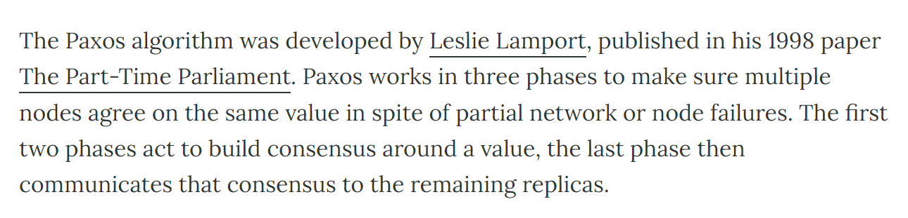

# **The Shadow Drive Platform**

## **Deterministic Naming**

The Shadow Drive platform is designed to support entire ecosystems being built on top of it. Shadow Drive storage is deterministic to allow for ease of use. While other storage protocols require the user to wait for data to be uploaded in order to generate a URI, Shadow Drive has a deterministic scheme:

**`https://shdw-drive.genesysgo.net/<storage-account-pubkey>/<file-name>`**

Information can be prepped for uploads, index, the creation of custom RPC calls, etc in advance. Meaning, application developers will find it much easier to pre-plan their builds in advance.

## **Developer Tools**
Builders can interact directly with Shadow Drive using the [API](/build/shadow-drive/the-api.md), the [CLI](/build/shadow-drive/the-cli.md) with optional [Rust CLI](/build/shadow-drive/the-cli.md) or the Shadow Drive [SDK](/build/shadow-drive/the-sdk.md) to build front-end applications directly on top of the drive. Providing SDKs in Javascript, Rust, and Python provides a number of benefits and efficiencies to developers. It allows developers to access the full range of features and capabilities of the application, and helps developers to quickly get up to speed on the application, since there’s less of a learning curve when working with a language they’re already familiar with.

It is our goal to empower developers to integrate Shadow Drive directly into their builds and to support this incredibly talented community of designers who will absolutely come up with better platforms for Shadow Drive than we could possibly come up with on our own!

## **Evolution**
### **Under the Hood of Version 1**

Coordinating between physically distributed object storage devices (OSDs) lives an open source software defined storage program called Ceph that we have customized for the Shadow Drive network of nodes.

**Ceph was initially chosen for a number of reasons…**

1. It is VERY open source. Ceph was first presented in 2006 and merged directly into the Linux kernel in 2010. Since then the Ceph GitHub has grown to 179 different repositories. These different repositories have been collectively forked over 10,000 times, have had thousands of PRs submitted, and has seen a community of tens of thousands emerge to provide support. [https://github.com/ceph](https://github.com/ceph)

2. It is extremely resilient and adaptable. Ceph is designed to not have a singular point of failure that could lead to data loss. As Shadow Drive is being designed to run in a permissionless trustless decentralized environment, having no singular point of failure is very attractive. The resiliency of how Ceph stores data and its open source design mean that Ceph can be forked and modified to be a trustless permissionless decentralized storage layer that can be integrated with smart contracts to protect the stored data against bad actors.

3. Ceph is very performant and scales exceptionally well both horizontally and vertically. Our decentralized cluster consistently handled 2,000 concurrent connections, each uploading 10,000 individual objects measuring 2mb in size, and sustained an upload speed of 2.7gbps with zero packet loss for extended periods of time. This means that the cluster is so fast that when Solana validators finish block #130188099 we can ingest it, store it, and serve live requests against it **before** block #130188100 is finished and propagated.

4. Ceph’s CRUSH map algorithm is amazing! CRUSH is a scalable pseudo-random data distribution function designed for distributed object-based storage systems that efficiently maps data objects to storage devices without relying on a central directory. The CRUSH whitepaper ([https://ceph.com/assets/pdfs/weil-crush-sc06.pdf](https://ceph.com/assets/pdfs/weil-crush-sc06.pdf)) dives deep into the algorithm but the TL;DR is that CRUSH allows for the decentralization of location for data on an individual byte level. Ceph utilizes CRUSH to literally break stored objects down into component bytes, shards/erasure codes those bytes, and then decentralizes their location in triplicate across any particular Ceph cluster.

5. Speaking of decentralization of data… Ceph runs its own consensus mechanism internally to ensure the integrity of your data. Monitor daemons are the custodians of the pieces of the CRUSH map and are responsible for verifying its accuracy and approving/recording changes to the stored data. Ceph monitors use a Paxos consensus mechanism to maintain a quorum and verify the authenticity of the data stored in the cluster. We will revisit the importance of this consensus mechanism later when we discuss Solana integrations.

6. Finally, Ceph is (theoretically) infinitely scalable without any notable decrease in performance. There is no theoretical max to how large a Ceph cluster can become. This is due to the different software daemons Ceph employs and how well the CRUSH algorithm scales. The largest Ceph cluster ever tested successfully stored 10,000,000,000 unique objects. If we think about each Solana block produced we are currently in the 120 millions (as of the time of this writing). Therefore, Ceph is uniquely positioned to be the best possible solution for a blockchain that produces a new block every 400 milliseconds.

### **As a fun side note**
The creator of the Paxos Consensus Mechanism, Leslie Lamport, is also honored as Solana’s biggest technical influence

Also, we’re using the same DB software as the CERN team is! [https://indico.cern.ch/event/649159/contributions/2761965/attachments/1544385/2423339/hroussea-storage-at-CERN.pdf](https://indico.cern.ch/event/649159/contributions/2761965/attachments/1544385/2423339/hroussea-storage-at-CERN.pdf)

In fact, the CERN team submitted PRs to the main Ceph branch to have their homegrown improvements included in the main branch. This is further evidence to the extent at which Ceph can be customized as a distributed system.

Of course, none of this is to suggest that Ceph is some kind of perfect solution that has no flaws and can do no wrong. However, for our use case and pathway to decentralization, Ceph checks all the boxes for an initial underlay to coordinate OSDs and provide us a foundation to begin customizing. The performance, reliability, durability, scalability, and its functionality can be adapted to provide the decentralized trustless data storage that Solana needs.

### **Building the overlay and Solana-PDA compatibility**
All system engineering problems start by choosing what puzzles need to be solved first. The most important question needing answered when we first set out was the whether or not Solana is fast enough and cheap enough to power on-chain proofs of storage for an enterprise level database. It was in short, the decision to approach the problem from the very top of the network stack that interfaces with notoriously "experimental" layer-1 chains before spending months designing a new erasure coding methods over a quickp2p protocol (which is a hint to what we've already accomplished on the bottom of the stack).

Shadow Drive v1 delivered a working Solana PDA, a rudimentary single file upload, and a basic SDK enabling early adopters and those seeking faster on-chain proofs for off-chain data a way to start building. It also brought significant opportunities for our engineers to test theories regarding scaling, speed, reliability on the front end. Shadow Drive V1.5 was conceived and scoped for front-end enhancements.  

### **Shadow Drive v1.5 is Born: Building Tools and Listening to Developer Feedback**
We had began work on DAGGER (bottom of the stack) but we needed deeper knowledge and a more data-driven process for nailing down DAGGER specification. We approached the DAGGER systems-level design requirements by **first** building overlay gateways, file servers, smart contracts, Solana PDAs, the CLI, APIs, and the SDKs that all together made Shadow Drive v1.5 a reality. Version 1.5 made it possible for off-chain data to live on Solana as an on-chain proofs of storage fast, reliable, and at scale. Furthermore, the design streamlines Solana as a transaction payment layer and a ledger of all Shadow Drive operations (storage used, payments made, files uploaded, etc. all on chain). This enabled us to spend cycles onboarding Web3 developers, identify performance and instability born by ledger interoperability rather than battle ghosts from systems-level experimenting.

## **Present Design Considerations**
A significant amount of constructive input has been provided by Shadow Ecosystem builders for which our team is extremely grateful. There continues to be a growing number of PRs opening, builder bounties, ideas, and new app use-cases that help drive front-end enhancements to Shadow Drive v1.5. This includes more parallel processing of bulk multi file uploads, increased file size limits, improve regional footprint of the cluster, and API enhancements that will increase speed and allow external apps to virtually mount their Shadow Drive accounts. This enables huge improvements in CDN capability for builders and streaming data-processing. Both social media use cases and AI use cases are well supported just to name two example.

This is not a comprehensive list of all improvement in the pipeline, however, are improvements that suggest the later stage cycles of optimization that the Shadow Drive front-end has reached. As a result of our rapid progress and positive feedback, we are well positioned to move efficiently into the mid-stages of the fully decentralized Shadow Drive v2.

Present design considerations are almost entirely focused on one of two things:
1) Optimizations to the well received v1.5 developer environment. This includes expanding the SDK and APIs to mobile and ensuring mobile brand presence.
2) Finish deploying the Shadow Drive implementation of DAGGER for intra-network comms and consensus. This includes closed alpha-pool testing with Shadow Operators as we finalize low-level comms improvement, canonical chunk shredding, 7:3 reed-solomon erasure coding, and many other elements of decentralized storage DLT.

Updates to our present design efforts will be published in the [Change Log](/reference/change-logs.md). More frequently document revisions are planned with additional content to added into the Shadow Drive resources.

