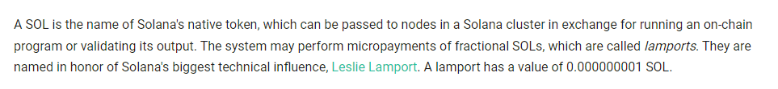

# Design

## **Developer Tools**

Builders can interact directly with Shadow Drive using the [API](../../build/shadow-drive/the-api.md), the [CLI](../../build/shadow-drive/the-cli.md) with optional [Rust CLI](../../build/shadow-drive/the-cli.md) or the Shadow Drive [SDK](../../build/shadow-drive/the-sdk.md) to build front-end applications directly on top of the drive.&#x20;

Providing SDKs in [JavaScript](../../build/shadow-drive/sdk-javascript.md), [Rust](../../build/shadow-drive/sdk-rust.md), and [Python ](../../build/shadow-drive/sdk-python.md)provides a number of benefits and efficiencies to developers. It allows developers to access the full range of features and capabilities of the application, and helps developers to quickly get up to speed on the application, since there’s less of a learning curve when working with a language they’re already familiar with.

### S3-Compatibility

S3-compatibility is a widely adopted standard in the cloud storage industry. Many providers now offer S3-compatible APIs and protocols, giving builders greater flexibility in choosing a cloud storage provider. This means developers can easily move data between different services without worrying about compatibility issues. Additionally, they can use their existing knowledge and tools when working with multiple services, eliminating the need to learn new APIs and protocols for each one. S3-compatibility also offers robust APIs that enable fast and reliable query, along with virtual mount capability, making it important for Web2, Web3, and the frontiers of distributed ledger tech and AI.

It is our goal to empower developers to integrate Shadow Drive directly into their builds and to support this incredibly talented community of designers who will absolutely come up with better platforms for Shadow Drive than we could possibly come up with on our own!

Release of S3-Compatibility upgrades set for Q2 2023.

### **Deterministic Naming**

The Shadow Drive platform is designed to support entire ecosystems being built on top of it. Shadow Drive storage is deterministic to allow for ease of use. While other storage protocols require the user to wait for data to be uploaded in order to generate a URI, Shadow Drive has a deterministic scheme:

**`https://shdw-drive.genesysgo.net/<storage-account-pubkey>/<file-name>`**

By preparing information for uploads, indexing, and creating custom RPC calls in advance, application developers can benefit from a more streamlined build process. This allows them to plan ahead and create their applications with greater ease and efficiency.

## **Evolution**

The path to decentralization is a journey through v1.0, v1.5, and the upcoming release v2.0 of Shadow Drive. This section walks through the build progression and rationale behind the engineering approach to Shadow Drive.

### **Under the Hood of Version 1**

Coordinating between physically distributed object storage devices (OSDs) lives an open source software defined storage program called Ceph that we customized for the Shadow Drive network of nodes for version 1.

**Ceph was initially chosen for a number of reasons…**

1. It is VERY open source. Ceph was first presented in 2006 and merged directly into the Linux kernel in 2010. Since then the Ceph GitHub has grown to 179 different repositories. These different repositories have been collectively forked over 10,000 times, have had thousands of PRs submitted, and have seen a community of tens of thousands emerge to provide support. [https://github.com/ceph](https://github.com/ceph)
2. It is extremely resilient and adaptable. Ceph is designed to not have a singular point of failure that could lead to data loss. As Shadow Drive is being designed to run in a permissionless trustless decentralized environment, having no singular point of failure is very attractive. The resiliency of how Ceph stores data and its open source design mean that Ceph can be forked and modified to be a trustless permissionless decentralized storage layer that can be integrated with smart contracts to protect the stored data against bad actors.
3. Ceph is very performant and scales exceptionally well both horizontally and vertically. Our decentralized cluster consistently handled 2,000 concurrent connections, each uploading 10,000 individual objects measuring 2mb in size, and sustained an upload speed of 2.7gbps with zero packet loss for extended periods of time. This means that the cluster is so fast that when Solana validators finish block #130188099 we can ingest it, store it, and serve live requests against it **before** block #130188100 is finished and propagated.
4. Ceph’s CRUSH map algorithm is amazing! CRUSH is a scalable pseudo-random data distribution function designed for distributed object-based storage systems that efficiently maps data objects to storage devices without relying on a central directory. The CRUSH whitepaper ([https://ceph.com/assets/pdfs/weil-crush-sc06.pdf](https://ceph.com/assets/pdfs/weil-crush-sc06.pdf)) dives deep into the algorithm but the gist of it is that CRUSH allows for the decentralization of location for data on an individual byte level. Ceph utilizes CRUSH to literally break stored objects down into component bytes, shards/erasure codes those bytes, and then decentralizes their location in triplicate across any particular Ceph cluster.
5. Speaking of decentralization of data… Ceph runs its own consensus mechanism internally to ensure the integrity of your data. Monitor daemons are the custodians of the pieces of the CRUSH map and are responsible for verifying its accuracy and approving/recording changes to the stored data. Ceph monitors use a Paxos consensus mechanism to maintain a quorum and verify the authenticity of the data stored in the cluster. We will revisit the importance of this consensus mechanism later when we discuss Solana integrations.
6. Finally, Ceph is (theoretically) infinitely scalable without any notable decrease in performance. There is no theoretical max to how large a Ceph cluster can become. This is due to the different software daemons Ceph employs and how well the CRUSH algorithm scales. The largest Ceph cluster ever tested successfully stored 10,000,000,000 unique objects. If we think about each Solana block produced we are currently in the 120 millions (as of the time of this writing). Therefore, Ceph is uniquely positioned to be the best possible solution for a blockchain that produces a new block every 400 milliseconds.

#### **As a fun side note...**

The creator of the Paxos Consensus Mechanism, Leslie Lamport, is also honored as Solana’s biggest technical influence

### Achieving Agreement in Distributed Systems

Paxos is a consensus algorithm used in distributed systems to achieve agreement among a set of nodes, even in the presence of failures or delays. It was proposed by Leslie Lamport in 1989 and is named after the Paxos island in Greece. The algorithm is designed to ensure reliability, fault tolerance, and consistency in distributed systems where nodes may fail or communicate unreliably.

The Paxos algorithm operates in a message-passing environment and involves several rounds of communication between nodes, called "proposers," "acceptors," and "learners." The algorithm ensures that a single, agreed-upon value is chosen among the proposed values by the nodes.

Here is a high-level overview of the Paxos algorithm:

1. A proposer node selects a unique proposal number and sends a "prepare" request to a majority of acceptor nodes.
2. Upon receiving a "prepare" request, an acceptor node checks if the proposal number is higher than any proposal number it has seen so far. If it is, the acceptor promises not to accept any proposals with a lower number and responds with the highest-numbered proposal it has accepted, if any.
3. The proposer collects responses from a majority of acceptor nodes. If a previously accepted value is reported, the proposer uses that value; otherwise, it chooses a new value. The proposer then sends an "accept" request to a majority of acceptor nodes with the chosen value and its proposal number.
4. If an acceptor receives an "accept" request with a proposal number that is equal to or higher than the highest proposal number it has seen, it accepts the value and sends an acknowledgment to the proposer.
5. The proposer considers the value chosen when it receives acknowledgments from a majority of acceptor nodes. At this point, the proposer can inform the learners about the chosen value.

The Paxos algorithm guarantees that only a single value is chosen, even in the presence of failures, as long as a majority of acceptor nodes can communicate reliably. It is a fundamental building block for many distributed systems and has inspired the development of other consensus algorithms, **such as DAGGER which is replacing PAXOS!**

Also, we’re using the same database technology as the CERN team is! [https://indico.cern.ch/event/649159/contributions/2761965/attachments/1544385/2423339/hroussea-storage-at-CERN.pdf](https://indico.cern.ch/event/649159/contributions/2761965/attachments/1544385/2423339/hroussea-storage-at-CERN.pdf)

In fact, the CERN team submitted PRs to the main Ceph branch to have their homegrown improvements included in the main branch. This is further evidence to the extent at which Ceph can be customized as a distributed system, which has proven itself over the past year as we have evolved it.

Of course, none of this is to suggest that Ceph is some kind of perfect solution that has no flaws and can do no wrong. However, for our use case and pathway to decentralization, Ceph checked all the boxes for an initial underlay to coordinate OSDs and provide us a foundation to begin customizing. The performance, reliability, durability, scalability, and its functionality can be adapted to provide the decentralized trustless data storage that Solana needs. It was this strong foundation that allowed us to channel energy into blockchain-based puzzles first (V1.5), soon followed by permissionless, decentralized network puzzles (DAGGER).

### **Building the overlay and Solana-PDA compatibility**

At the core of any system engineering problem is the decision of which problems to tackle first. When we began our work on Shadow Drive v1.0, we knew that one of the most important questions we needed to answer was whether or not Solana was fast and cheap enough to handle on-chain proofs of storage for an enterprise-level database. This was a critical decision that required us to approach the problem from the very top of the network stack, where we interface with notoriously "experimental" layer-1 chains.

Rather than spending months designing new erasure coding methods over a QUIC peer-to-peer protocol, which is something we have already accomplished at the bottom of the stack, we decided to focus on the higher-level issues first. This allowed us to more quickly discover how to best use Solana prior to investing significant resources in the bottom-up design of the Shadow Storage network.

By starting at the top of the network stack, we were able to quickly evaluate Solana's suitability for our use case, and determine if it was fast and cheap enough to power on-chain proofs of storage for an enterprise-level database. This decision allowed us to move forward with confidence, knowing that we had made the right choice and could begin designing the rest of the system with an eye towards efficiency and scalability. What exactly is a Solana-PDA?

#### **Defining a Solana-PDA:**

Solana PDA stands for Solana Program Derived Address. It is a unique public key address generated by a Solana program that can be used to store or retrieve data on the Solana blockchain. In Solana, programs are run on-chain as part of the transaction processing flow. PDAs allow programs to store data without having to use a specific account, making it easier and more efficient to manage data on the Solana blockchain.

PDAs are derived from a combination of the program ID and a specific seed value chosen by the program. The seed value is typically a hash of some piece of data related to the program or the data being stored. This creates a unique PDA that is tied to the program and the data being stored. They allow for more efficient and flexible data management on the Solana blockchain, improving the scalability and usability of the network.

Shadow Drive v1 delivered a working Solana PDA, a rudimentary single file upload, and a basic SDK enabling early adopters and those seeking faster on-chain proofs for off-chain data a way to start building. It also brought significant opportunities for our engineers to test theories regarding scaling, speed, reliability on the front end. Shadow Drive V1.5 was conceived and scoped for front-end enhancements.

### **Shadow Drive v1.5 is Born: Building Tools and Listening to Developer Feedback**

Our work on DAGGER began at the bottom of the stack, but we quickly realized that we needed a more data-driven process and deeper knowledge to nail down the DAGGER specification. To approach the DAGGER systems-level design requirements, we began by building overlay gateways, file servers, smart contracts, Solana PDAs, the CLI, APIs, and SDKs that together made Shadow Drive v1.5 a reality.

With Shadow Drive v1.5, we made it possible for off-chain data to live on Solana as on-chain proofs of storage that are fast, reliable, and scalable. This design allowed us to streamline Solana as a transaction payment layer and a ledger of all Shadow Drive operations, from storage used and payments made to files uploaded and more, all on-chain. This approach enabled us to onboard Web3 developers and identify performance and instability issues stemming from ledger interoperability, rather than battling ghosts from systems-level experimentation.

By building out these foundational components first, we were able to gain a deeper understanding of the underlying systems and identify areas where we could optimize for efficiency and scalability. This data-driven approach allowed us to make informed decisions about the DAGGER specification, ensuring that it was tailored to our specific needs and capable of supporting the demands of an enterprise-level database.

Overall, our approach to the DAGGER systems-level design requirements was focused on building a solid foundation that would allow us to scale efficiently and effectively. This approach enabled us to streamline Solana as a transaction payment layer and a ledger of all Shadow Drive operations, while also providing the flexibility and scalability needed to support future growth and development.

## **Present Design Considerations: Advancing towards v2.0**

Our team is immensely grateful for the invaluable insights and contributions from the dedicated Shadow Ecosystem builders. We've experienced a surge in pull requests, builder bounties, innovative ideas, and novel app use cases, all of which have significantly contributed to driving front-end enhancements to the cutting-edge Shadow Drive v1.5.

These enhancements feature advanced parallel processing techniques for bulk multi-file uploads, enabling increased file size limits and an optimized regional footprint of the storage cluster. Furthermore, the enhanced API offers improved performance and permits external apps to virtually mount their Shadow Drive accounts, paving the way for substantial advancements in CDN capabilities for builders and streaming data-processing. This support extends to a diverse range of use cases, from social media platforms to next-generation AI applications.

Though this overview does not encompass all the improvements in the pipeline, it showcases the advanced optimization stage that the Shadow Drive front-end has reached. Our swift progress and overwhelmingly positive feedback have positioned us to efficiently transition into the intermediate stages of the fully decentralized Shadow Drive v2.

**Our current design endeavors are primarily focused on the following objectives:**

1. Refining the acclaimed v1.5 developer environment by extending the SDK and APIs to mobile platforms, thereby ensuring a solid mobile brand presence. This expansion facilitates greater developer engagement, fostering rapid growth and increased market penetration.
2. Finalizing the deployment of the Shadow Drive implementation of DAGGER for seamless intra-network communication and consensus. This process includes closed alpha-pool testing with Shadow Operators as we perfect low-level communication improvements, canonical chunk shredding, 7:3 Reed-Solomon erasure coding, and numerous other components of decentralized storage DLT. Implementing these advanced features sets the stage for future scalability, robustness, and adaptability, further solidifying our position in the market.

Stay tuned for updates on our cutting-edge design efforts, which will be published in the [Change Log](../../reference/change-logs.md). We're planning more frequent document revisions and expanding the wealth of content in the ever-growing Shadow Drive resources. As a result, we anticipate accelerated growth and market capture, driven by our commitment to innovation and technological excellence.
