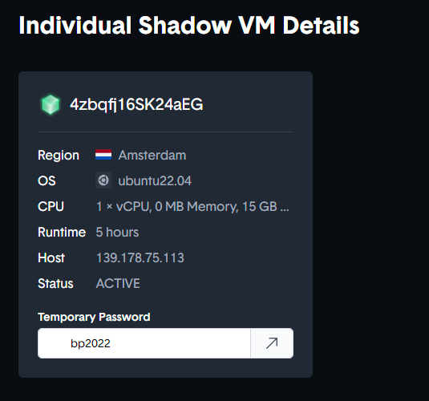

# Solana Breakpoint 2022 Demo

<figure><figcaption></figcaption></figure>

### Get Setup on Devnet

Before you get started trying to tackle this demo, I want to be perfectly clear - you need your wallet set to Devnet. By default, when you work with a wallet like Phantom or Solflare, it will be set to mainnet. You need to go into your wallet settings to select Network...

<figure><figcaption></figcaption></figure>

And flip it to be on Devnet (see, its set to Mainnet by default. You want Devnet to be checked).

<figure><figcaption></figcaption></figure>

Now don't freak out if you don't have any SOL or USDC in your Devnet account. We got you covered there. Navigate to this site to kick off the demo 👇


Demo Deploying At BreakPoint


After connecting your wallet, you'll land on the dashboard page of the D.A.G.G.E.R. demo. See these two buttons at the top right? Click these to airdrop some SOL and USDC into your Devnet wallet. Don't get too carried away now; save some for the rest of us. Only take what you need.

<figure><figcaption></figcaption></figure>

### Create a VM

Now that you're right with Devnet, let's see how easy it is to deploy a VM. It's so easy, a prehistoric anthropomorphic spokesperson for an auto insurance company could probably pull it off without violating copyright and trademark rules.

In the center of your screen, you'll see the big button. Give it a tappy.

<figure><figcaption></figcaption></figure>

You are transported to the next screen, where you'll answer a few questions, starting with...

#### Where?

<figure><figcaption></figcaption></figure>

For this demo, Amsterdam is the only clickable option, but you can see where the plans for expansion lie. Select Amsterdam to see it highlighted in green and scroll down to the next decision. But before you do, make sure you notice some important text. All VMs deployed in that data center from the same wallet will communicate directly to each other over private IP space. So if you deploy multiple VMs, they will already be placed within the same private VLAN.

Now for the next question...

#### Which?

Which OS do you want to use? Currently, Linux distros are supported. Note: there is a dropdown within the distro where multiple versions will be available.

<figure><figcaption></figcaption></figure>

#### How much?

How much horsepower you need, boss? And do you want to take backups of your data, too? Note: The options displayed by default are pre-configured, cookie cutter VMs. You will have the ability to click Custom Configuration and create your own specs for the VM deployed.

<figure><figcaption></figcaption></figure>

#### Who?

And lastly is how you want authentication to be handled by the VM. We can generate a password for you, or drop some SSH keys to use inside the VM.

<figure><figcaption></figcaption></figure>

It's go time. Click the Pay with Solana Pay button and the provisioning begins. It will take a couple minutes to deploy, but after that, you'll have a full fledged VM running on decentralized infrastructure. After a few minutes, you will see a dialog box that says "ready fren?" and we know you are, in fact ready. You are directed back to the landing page where your Dashboard will now show you your VM details.

<figure><figcaption></figcaption></figure>
