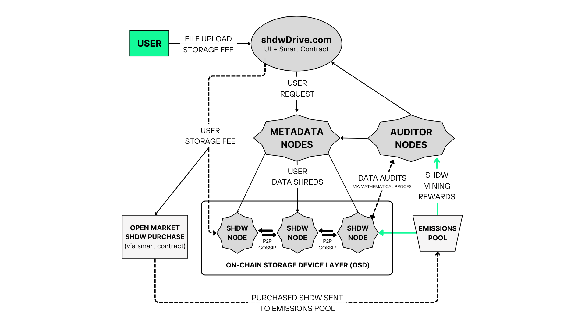

# Utility

[Start here](https://www.shdwdrive.com/blog/unlocking-the-shdw-token) for comprehensive details on $SHDW's utility. We encourage everyone to read the article in addition to the technical summary below.



### Unlocking the Value of the SHDW Token

SHDW is a unique cryptocurrency that is designed for the sustainability and security of decentralized data storage infrastructure. Network mechanisms such as staking, halving, slashing, and recycling - are carefully designed to work together to make SHDW an effective tool for securing the network and driving value. These mechanics, along with rewards and incentives, are designed to convert token holders into active participants who are helping to secure the network.

<figure><figcaption>
High-level Network Architecture
</figcaption></figure>

### **Staking and Network Participation**

Staking is a mechanism in which holders earn rewards for holding their tokens. Holders who stake their SHDW tokens instead of spending or trading them are rewarded for participating in and helping to secure the network. This process of rewarding holders for participating in the network is central to our ecosystem and is a core component of our overall design process. We believe that staking mechanics simultaneously drive value for both the network and for holders.

Operators of shdwNodes are the foundation of the SHDW network, ensuring its smooth operation. To connect a server to the shdwDrive network and earn rewards, a potential shdwNode must stake SHDW to secure its place in the network. This requirement is like a commitment fee, ensuring that only serious and dedicated participants manage the network. While the exact amount is still to be determined, we believe the amount should be significant enough to make becoming a shdwNode Operator a decision not to be taken lightly. Operators signify their commitment to the network's health and efficiency by effectively putting down a security deposit in the form of staking. This ensures a robust and reliable system, which is crucial for the network's overall performance, maintaining the truth of our users and, ultimately, the value of SHDW.

All of that said, not everyone desires to become a shdwNode Operator and even those who aspire to may face challenges in meeting the staking requirement individually. Additionally, feedback has made it clear to us that members of the SHDW community of all levels of technical expertise are very eager to contribute to the network in meaningful ways. This is where shared staking comes into play.

SHDW Holders delegate their SHDW tokens to shdwNode Operators via smart contract and then share in the emissions the node receives. The rewards from the emissions smart contract to a shdwNode are then split between the shdwNode Operator and the SHDW holders who staked with that shdwNode Operator. This shared success model fosters a strong community bond and incentivizes both parties to contribute positively to the network's growth.

**Shared Staking**

* Staking: Holders earn rewards for securing the network.
* shdwNode Operators: Must stake SHDW to connect a server to shdwDrive.
* Shared Staking: Allows SHDW holders to delegate tokens to shdwNode Operators through a shared stake pool and share in node emissions.

**Staking is live for Testnet 2!** [**Join in** ](https://testnet.shdwdrive.com/)**and earn more SHDW!**

### **Revenue Sharing and Tokenomics**

We are committed to making the shdwDrive network tokenomics as sustainable as possible in the long term while simultaneously ensuring that value is being accrued to the token as the shdwDrive user base grows and revenues scale.

**Revenue and Rewards**

Tokenomics for $SHDW incorporate a revenue-sharing model, where storage customer fees are partially distributed to shdwOperators and partially used for SHDW buybacks from the open market. These buybacks support the token's liquidity and are added to the emissions pool, contributing to a sustainable token economy. The token's revenue share and halving schedule align incentives across the network.

* Storage fees: 60-75% to shdwOperators, remainder used for SHDW buybacks.
* Buybacks: Increase demand for SHDW and contribute to liquidity.
* Emissions Pool: Buyback SHDW is added to the emissions pool, slowing token velocity.

**Slashing Mechanism**

Slashing is a critical mechanism for maintaining fairness and security within the SHDW network. It's a penalty system for shdwNode Operators that protects the network against nodes that are failing to perform their role in the network and bad actors looking to damage the network.

* Slashing: Penalty for shdwNode Operators if nodes underperform or act maliciously.
* Penalty: Loss of 5% of staked SHDW, which must be replaced to avoid removal from the network.

**Auditor Nodes**

Servers and mobile devices acting as Auditor Nodes participate in the vital task of auditing the integrity of the data stored on the ShdwDrive network via a system of mathematical proofs similar in concept to Proof of Work mining. Rewards are earned by solving the mathematical proofs submitted by shdwNode Operators in order to prove their truthfulness and trustworthiness.

* Auditor Nodes: Server or Mobile devices that audit network data integrity.
* Rewards: Emissions for solving mathematical proofs.
* Slashing: Applies to Auditor Nodes acting in bad faith.

**Recycling Slashed Tokens**

shdwDrive recycles these tokens back into the SHDW ecosystem.

* Slashed SHDW tokens are returned to the emissions pool.
* Extends reward distribution.
* Reduces token velocity.
* Efficient resource utilization and commitment to sustainability.

**Halving Schedule**

The concept of halving is a method to control supply and, by extension, enhance value. This scarcity mechanism potentially increases SHDW's value over time as it encourages network participants to be early adopters of shdwDrive and D.A.G.G.E.R. 's technology by rewarding early supporters with higher rewards. This works towards creating a sense of urgency in attracting new network participants, which benefits the entire network by scaling resources and user growth.

* Controls supply and enhances value.
* 7,000,000 SHDW locked for emissions, with annual payouts.
* Halving every two years to decrease new tokens entering the market.

#### **Ecosystem Growth and Scalability**

The $SHDW token is central to orchestrating a dynamic and interconnected ecosystem. It incentivizes participation, secures compute capabilities, and facilitates network scalability. As shdwDrive grows, the demand for SHDW increases, enhancing the token's value proposition. The token's design encourages behaviors that drive value, including reduced token velocity and active network participation, fostering a robust and scalable infrastructure.

#### **Community-Driven Innovation**

Through shared staking and community feedback mechanisms, $SHDW holders are empowered to contribute to the network's direction and success. This collaborative approach ensures that as the shdwDrive platform scales, so does the value accrued to the SHDW token, benefiting all stakeholders in the ecosystem.'

These mechanics all come together to create a unique and important dynamic, which ensures there is a definitive, verifiable link between shdwDrive revenue growth and value accrual in the SHDW token. This also incentivizes anyone with a vested interest in the ShdwDrive platform to help market the platform and grow the user base.

Ultimately, our goal with everything we do is to ensure that as the platform scales in success, so does the amount of value the SHDW token accrues. Not only does this dynamic achieve this goal, but it also gives SHDW holders a way to take action that will directly impact the token they hold in a way that requires zero technical knowledge.

**Feedback and Community Involvement**

* Community feedback is encouraged and can be provided at https://github.com/GenesysGo/shdw-improvement-proposals/.

The SHDW Token can be purchased on [Jupiter.](https://jup.ag/swap/USDC-SHDW)
